# taskrecap

**One living record per task, built from your Claude Code sessions.**

You work on several repos, each with many tasks. Weeks later you need to know *what was done in that task, what was decided and why, and what is still pending*, and the answer is scattered across dozens of Claude conversations. taskrecap reads your local sessions, groups them by task, and writes a **capsule**: objective, timeline, decisions with their reasons, files and commits, dead ends, what was left out, what is pending, and a briefing you can paste into a fresh Claude session to pick the task up again.

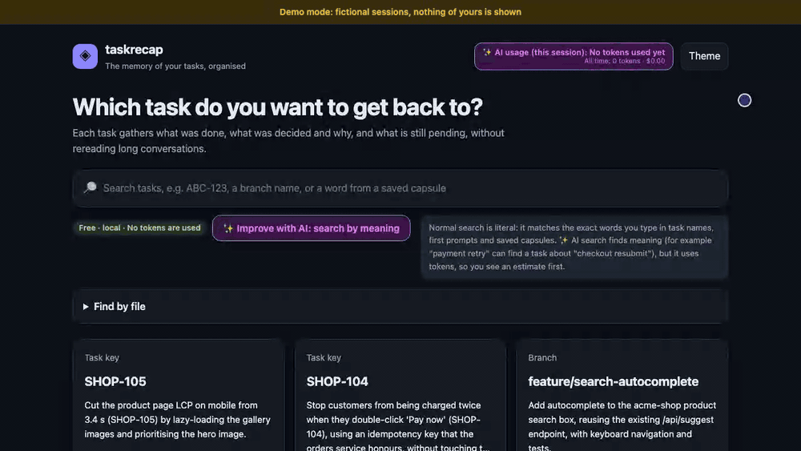


<table>
  <tr>
    <td width="50%">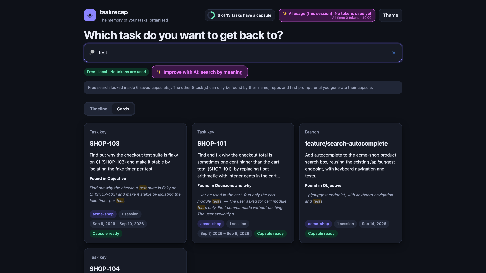</td>
    <td width="50%"></td>
  </tr>
  <tr>
    <td></td>
    <td></td>
  </tr>
</table>

<sub>All screenshots use the built-in fictional demo data (`taskrecap --demo`). The AI progress screenshot is taken from a scripted stream, so no tokens are spent producing it. Dark theme is supported too.</sub>

## Quickstart

```bash
npx taskrecap --demo     # try it with fictional sessions: nothing of yours is shown
npx taskrecap            # your real sessions: opens http://127.0.0.1:8765
```

Or install it once:

```bash
npm install -g taskrecap
taskrecap
```

taskrecap reads the session transcripts Claude Code already saves on your machine, in `~/.claude/projects/`. Nothing is uploaded anywhere. Use `--projects-dir <path>` to point it somewhere else.

Requires Node 18+ and, only to *generate* capsules or use AI search, [Claude Code](https://claude.com/claude-code) logged in. No other dependencies.

```bash
taskrecap list               # tasks detected in your sessions
taskrecap generate ABC-123   # one capsule from the terminal (asks before spending)
taskrecap --help
```

## How it is different

Existing tools (history viewers, session browsers, search UIs) treat a session as a **conversation to read**. taskrecap treats the **task** as the unit and gives you the *distilled result*:

| Viewer / search tools | taskrecap |
|---|---|
| Browse and search chats | One record per task, across sessions and repos |
| You reread the conversation | Decisions and the *why*, each one citing the session turn it came from |
| Resume the old, heavy chat | Resume with a clean briefing in a **new** session |

## The timeline: where did the work go?

The home page opens on a **timeline**, free and local: one row per task, one dot per day with prompts in its sessions, coloured by repo. A bigger dot means more prompts, and a dot opens the task. A task spread over several days and sessions, or two tasks worked in the same session, show up at a glance. Filter by repo and date, or switch to the cards view (your choice is remembered).

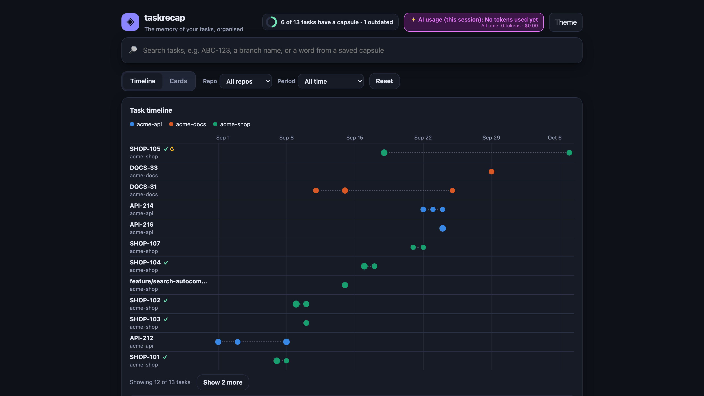

The thin dotted line only joins a task's first and last day, it is not time worked. Dates are approximate: a session that mixes several tasks counts for every task its prompts cite. The header also shows how many tasks have a capsule; click it to list the ones that don't.

## No capsule yet? Read the task anyway

Every task page has a **Sessions** section, with or without a capsule, free and local: its sessions with date, repo, branch and number of messages. Open a session to read your own messages in order (secrets masked) and click one to see the original conversation around it, with the command to resume it. When a session also holds other tasks, the messages that cite the task are highlighted and a filter lists only those.

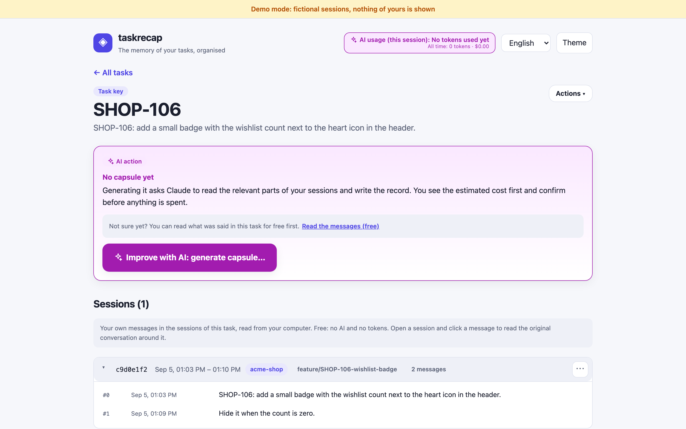

## Capsules for work without a task key

A single session, a group you made, or a part of a session cut by AI gets a capsule exactly like a task does. There is nothing to look for in these units (the unit *is* those sessions, or exactly the message ranges you accepted), so taskrecap skips the three "which turns belong to the task" calls: only the editor tags, slash commands, greetings and automatic messages are left out, the estimate shows one call, and the progress log says the selection step was not needed. The capsule is written from the unit's name and content and never invents a task key; the same cards, timeline, search inside capsules, file index, evidence panel and "Resume this task" briefing work for it. Task keys and branches work as before.

Capsules are saved under the stable id of the unit. Capsules of task keys and branches keep the file names they always had (`SHOP-101.json`), so nothing written by an earlier version is renamed or lost. When a unit changes, its capsule never silently lies: **renaming** keeps it; after a **merge, split or move** the new unit starts without a capsule, the old one stays on disk, and the new unit's page offers **Reuse that capsule** (a copy, marked *Outdated: the sessions of this unit changed* until you regenerate it). Nothing is deleted or regenerated by itself.

<table>
  <tr>
    <td width="50%">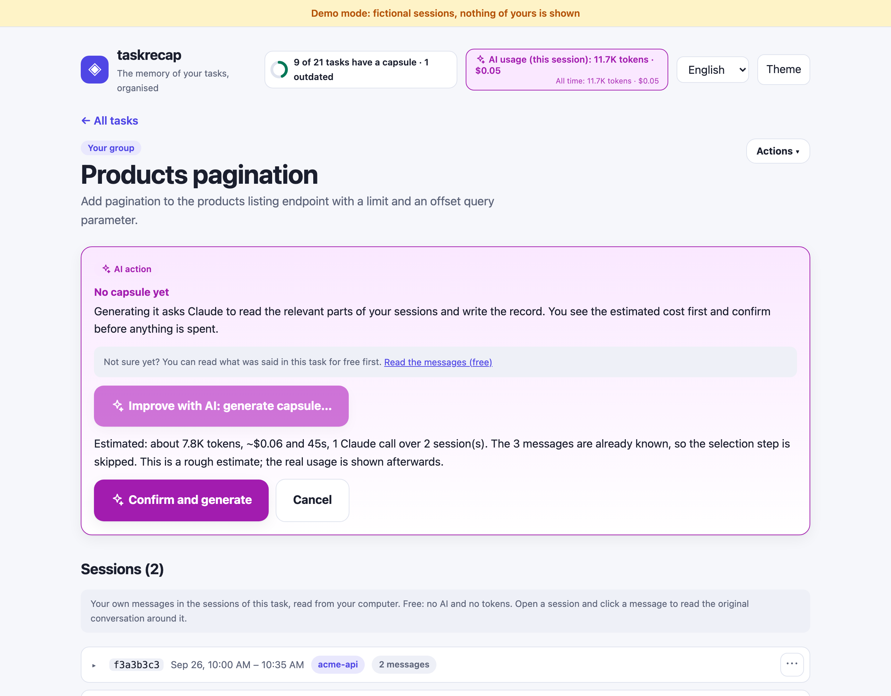</td>
    <td width="50%">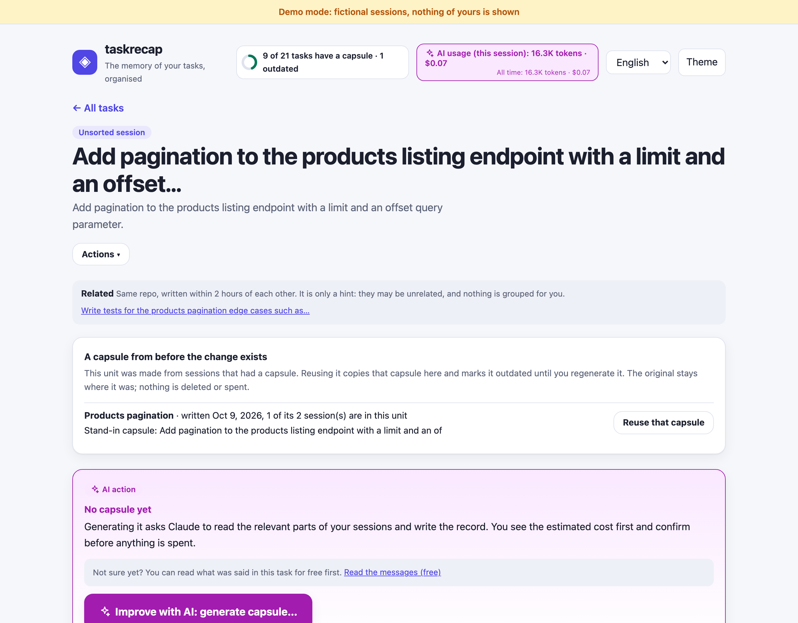</td>
  </tr>
</table>

## Is the capsule up to date?

A capsule is a snapshot. If you keep working on the task afterwards, taskrecap notices, for free, by comparing the capsule's date with your newer messages: the card, the timeline row and the capsule page show **Outdated: N new messages since <date>**, and "See the new messages" lists exactly those. **Update with AI** regenerates the whole capsule (with the usual estimate and confirmation, so you know the cost first); nothing is regenerated automatically. A capsule without a date is never flagged.

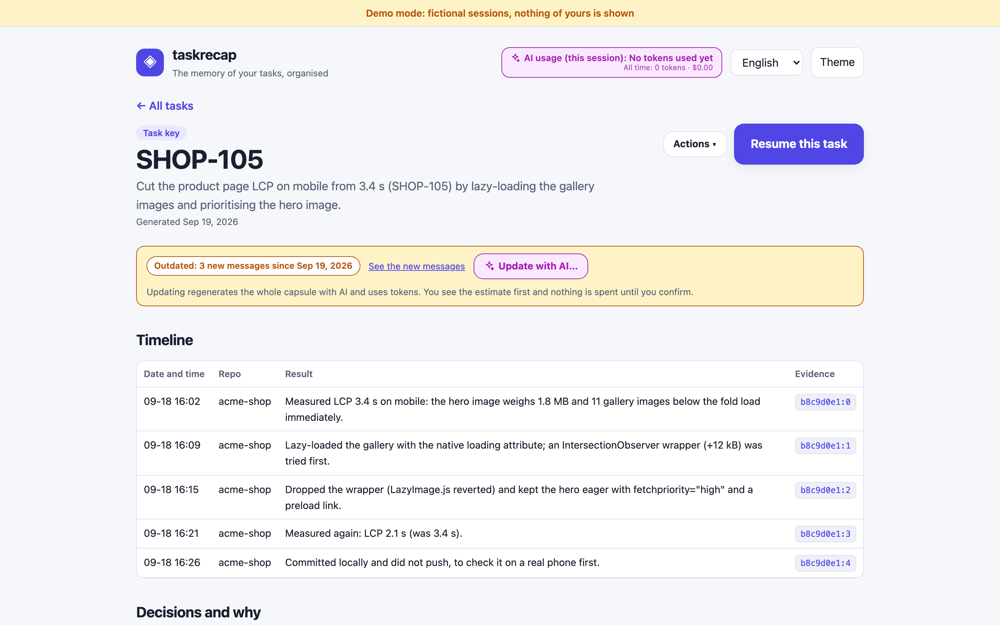

## Two modes: free and AI

The dashboard keeps what is free apart from what uses tokens, and always tells you which is which.

| | Normal mode | ✨ AI mode ("Improve with AI") |
|---|---|---|
| Cost | **Free, 100% local** | Uses tokens from your own Claude login |
| Browse tasks, see them on the timeline, read the messages of any task, see which capsules are outdated, open saved capsules, copy a briefing | ✅ | |
| Search | **Literal**: every word you type must appear in a task name, repo, first prompt or saved capsule text | **By meaning**: "payment retry" can find a task about "checkout resubmit" |
| Write a capsule | | ✅ "Generate capsule" |

Every AI action shows an **estimate (tokens and dollars) first and needs your confirmation**. Afterwards it shows the real usage. A counter in the header keeps the tokens and dollars spent since the app started, plus an all-time total (kept in `~/.taskrecap/usage.json`).

## Privacy

- Everything runs **locally**. The dashboard binds to `127.0.0.1` only and rejects requests from other sites.
- Your sessions are read from `~/.claude/projects` and never uploaded by this tool.
- The only network use is the `claude -p` call that **you confirm**, using your own Claude Code login (no API keys). Before that call, secrets (tokens, passwords, keys) are redacted from the text sent.
- Capsules are cached in `~/.taskrecap/` (nothing is written inside your Claude folders).
- Capsules may still contain sensitive details from your work. Treat them like your sessions.

## How task detection works

Everything you see on the home page is a **work unit**. Each session joins a unit in layers, and the tool **never invents a key**:

1. A key found in the git branch name (default pattern `ABC-123`, Jira style).
2. The most frequent key in your prompts and commit commands.
3. The branch name itself, when it is not a generic one (`main`, `master`, `develop`, ... plus any you add).
4. Otherwise the session is its **own unit**, listed as *Unsorted* and named after Claude Code's own title for it or, failing that, the first meaningful message you wrote (at most 80 characters). **Nothing is ever merged automatically.**

A session whose messages are only greetings, slash commands, editor notes or fewer than four words ("hola", "resume", "/code-review") says nothing about the work: those are folded into one collapsed group, **Sessions without content**, which you can still open.

Same repo and written within two hours of each other? The cards show a small *Related* hint. It is only a hint: free similarity checks (text, files) did not separate tasks reliably in our measurements, so nothing is grouped for you.

You are in charge: from the **⋯** menu of any card, timeline lane or unit page you can **rename** a unit, **merge** units into a group of yours, **move** a session to another unit or to a new group, **split** a group back, and **hide** units or sessions (they stay under *Hidden*). Every change has an **Undo**, is saved next to your capsule cache (never inside the Claude folders), always wins over the automatic grouping and is kept when new sessions arrive. Every unit can get a capsule, with or without a task key (see below).

<table>
  <tr>
    <td width="50%">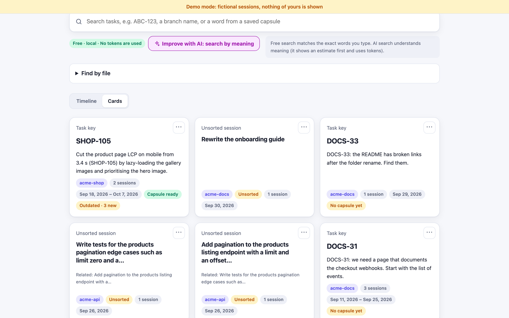</td>
    <td width="50%">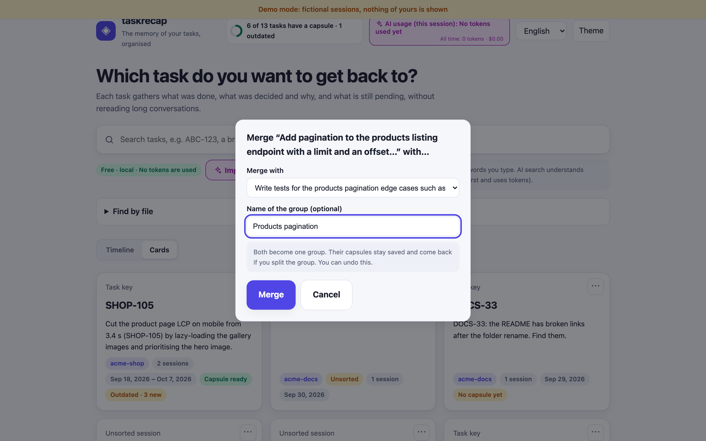</td>
  </tr>
</table>

### Settings

No Jira required. Put your own patterns in `~/.taskrecap/config.json`:

```json
{
  "keyPatterns": ["\\b[A-Z][A-Z0-9]{1,9}-\\d{1,6}\\b", "#\\d{2,6}\\b"],
  "ignoreBranches": ["staging", "qa"]
}
```

- `keyPatterns`: a list of regular expressions (any of them makes a key). Default: Jira style, `ABC-123`.
- `ignoreBranches`: branch names that mean "no task", in addition to `main`, `master`, `HEAD`, `develop` and `dev`.
- Instead of the file: `--key-regex` or `TASKRECAP_KEY_REGEX` (one pattern), `TASKRECAP_KEY_PATTERNS` (a JSON array), `--ignore-branches a,b` or `TASKRECAP_IGNORE_BRANCHES`. Precedence: flag, then environment, then the file, then the default.
- A bad pattern or a broken file is an error that says which setting is wrong; `npx taskrecap doctor` shows what is in force.

Real sessions often mix several tasks, so for a key cited inside a longer session the tool asks Claude (3 votes, union of the answers, for stability) which turns belong to the task. Cheap heuristics (time gaps, new keys, topic shift) propose the candidate boundaries.

## How cost works

A capsule takes 1 call to write plus, for multi-task sessions, up to 3 short calls to pick the turns. In our tests a task cost roughly **$0.05 to $0.40**, and an AI search a few cents. The estimate shown before you confirm is rough; the real usage is shown afterwards. Results are cached on disk, so viewing a capsule is free. `--votes 1` is cheaper but less stable.

## Options

| Flag | Meaning |
|---|---|
| `--demo` | use the built-in fictional sessions |
| `--port <n>` | dashboard port (default 8765; the next free one is used if busy) |
| `--projects-dir <dir>` | where Claude Code stores sessions (default `~/.claude/projects`, or `$CLAUDE_CONFIG_DIR/projects`) |
| `--claude-path <path>` | full path to the `claude` executable, if it is not found automatically |
| `--key-regex <regex>` | what a task key looks like (or use `keyPatterns` in `~/.taskrecap/config.json`) |
| `--ignore-branches <a,b>` | branch names that mean "no task" |
| `--no-open` | do not open the browser |
| `--lang <code>` | UI language (see CONTRIBUTING) |
| `--votes <n>`, `--model <name>` | generation settings |

Environment: `TASKRECAP_HOME`, `TASKRECAP_PROJECTS_DIR`, `TASKRECAP_KEY_REGEX`, `TASKRECAP_KEY_PATTERNS`, `TASKRECAP_IGNORE_BRANCHES`, `TASKRECAP_CLAUDE` (the older name `TASKRECAP_CLAUDE_BIN` still works).

## Troubleshooting

Start with `npx taskrecap doctor`. It checks Node, your sessions folder and Claude Code, and prints the next step for anything that is wrong. Browsing, the timeline, free search and evidence never need Claude Code; only the actions marked AI do.

**"Claude Code was not found" / the AI buttons are disabled.** taskrecap looks for `claude` in this order: `--claude-path` or `TASKRECAP_CLAUDE`, then your `PATH`, then the usual install folders (`~/.local/bin`, `~/.claude/local`, Homebrew, npm and nvm globals; on Windows also `%USERPROFILE%\.local\bin`, `%APPDATA%\npm` and `%LOCALAPPDATA%\Programs`). If Claude Code works in your terminal but taskrecap cannot find it, ask the terminal where it is and pass that path:

```bash
# macOS / Linux
which claude
npx taskrecap --claude-path /full/path/to/claude

# Windows (PowerShell)
Get-Command claude | Select-Object -ExpandProperty Source
npx taskrecap --claude-path "C:\path\to\claude.exe"
# or, for every run:
setx TASKRECAP_CLAUDE "C:\path\to\claude.exe"
```

After installing Claude Code, press **Check again** on the page; no restart is needed.

**Windows notes.** `claude.exe` (the native installer) and `claude.cmd` (the npm shim) are both supported; a `.cmd` shim is started through `cmd.exe` with every argument escaped, and your prompt is sent through standard input, never on the command line. A terminal opened before you installed Claude Code may not have it on `PATH` yet: open a new one.

**"Not logged in".** Run `claude` once in a terminal and log in. taskrecap cannot check the login for free (that would need a paid call), so it tells you when an action fails because of it.

**No sessions found.** Use Claude Code in a project first, or point to the folder with `--projects-dir`. `npx taskrecap --demo` works without any sessions.

### Organize unsorted sessions with AI (optional, you review every proposal)

Free checks cannot tell tasks apart, so for the *Unsorted* sessions there is an opt-in **✨ Organize with AI** step. It shows an estimate and asks you to confirm before spending anything, then reads only a **short, redacted summary of each session** (a few messages, the edited files; never the whole conversation) and comes back with **proposals**, never changes:

- a clear **title** for a session (also from a single session's **⋯ → Name with AI**),
- a **group** of sessions that are the same piece of work, and
- the **cut** of a long session that switches subject into one unit per range of messages.

Every proposal lists its **evidence** (click a citation to read the original message). Nothing is applied until you **Accept** it (or **Edit title** first); **Reject** is remembered, and *Accept all high-confidence* is a single change. Accepted proposals go through the same corrections as everything you do by hand: labelled *AI-organized*, undoable, and your own renames, merges and moves always win. The same sessions are never asked twice, and the result stays saved on your machine.

<table>
  <tr>
    <td width="50%">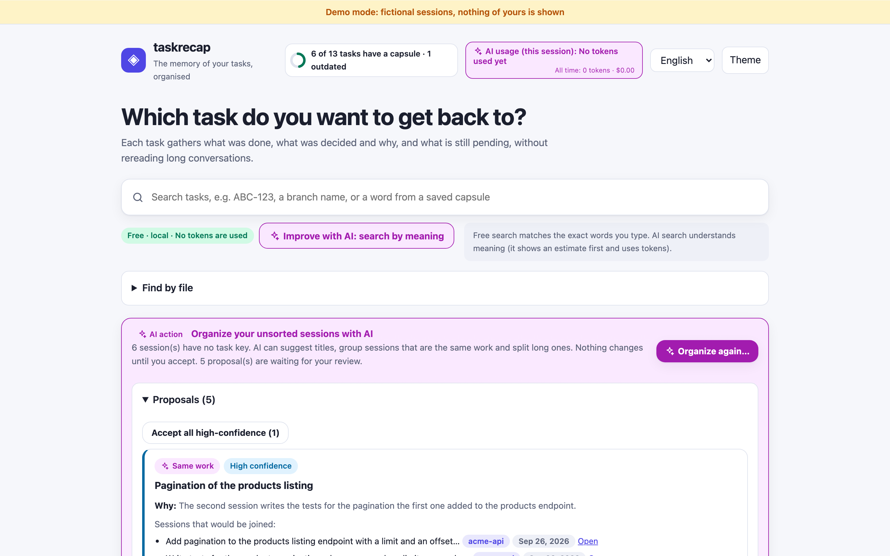</td>
    <td width="50%">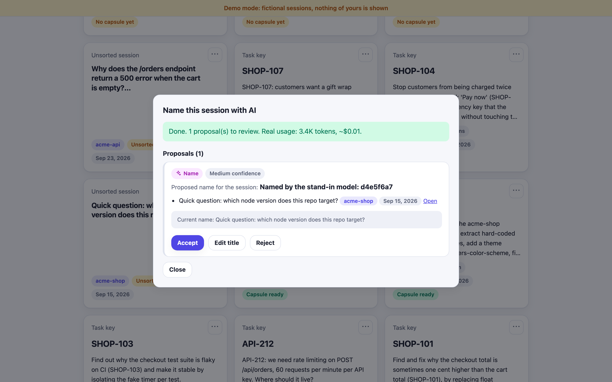</td>
  </tr>
</table>

How well does it work? We measured it on real sessions with the task keys and branch names **hidden** from the model (19 labelled sessions of one developer; the answer to compare with was the key they had before). Titles were far more informative than the free first-message titles (1.8 vs 0.8 on a 0-2 scale, one rater). Groups were rare and prudent: no false merge in the final run, but it found only 1 of the 48 real same-task pairs. Cuts of long sessions are useful starting points, not exact (1 of 4 proposed boundaries matched the hand-made ones). One pass over 40 sessions cost about US$0.15. Treat it as a way to get names and rough cuts, not as an automatic organizer.

## Honest limitations

- **Claude Code's session format is not documented** and can change. If a Claude Code update breaks parsing, please open an issue with the version.
- Tested so far on a small number of real sessions from one developer. Detection quality on other workflows is the biggest unknown, so feedback is very welcome.
- Sessions with no task key and no feature branch are listed one by one as *Unsorted* units. Grouping them is up to you (merge, move, rename) or, optionally, AI proposals you review: free text or file similarity did not separate tasks reliably, and the AI step is conservative about merging and approximate about cuts (see above). 
- "Outdated" counts your newer messages in the unit's sessions (for a session shared with other tasks, only the messages that cite the task key; for a part of a session, only the messages of its range) and notices when the sessions of a unit changed. Updating regenerates the whole capsule (no incremental update yet).
- The "reverted" and "possibly undone" marks are heuristics; git history is not read.
- Commits you make in another terminal are not seen (only those that appear in the sessions).
- The LLM can still misread evidence. Decisions without a valid citation are dropped, and every decision shows its citation, but you should verify what matters.
- The UI is English only for now (translatable, see CONTRIBUTING).

## Roadmap

- Optional connectors that add title and status to a task: Jira, GitHub Issues, Linear.
- Read git history to confirm commits and reverts.
- Task detection that needs no key at all (topic clustering across sessions).
- More cross-task views (files shared between tasks already work; richer relations next).
- Packaged as a Claude Code plugin as well.

## Development

```bash
npm test      # node:test; the LLM is always mocked, tests never spend tokens
npm run demo  # dashboard with the fictional sessions
```

See [CONTRIBUTING.md](CONTRIBUTING.md). MIT licensed.
