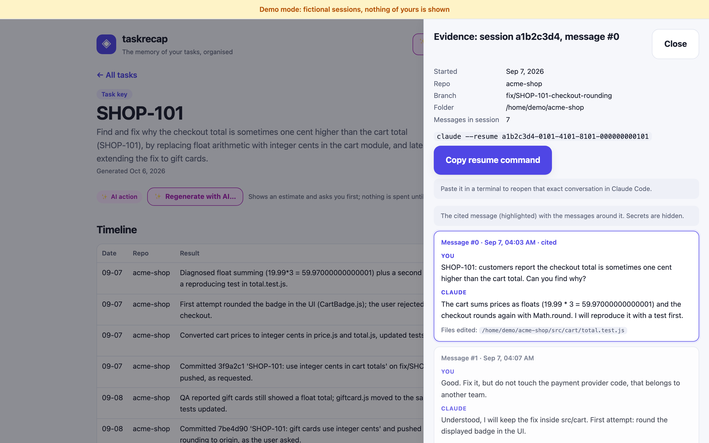
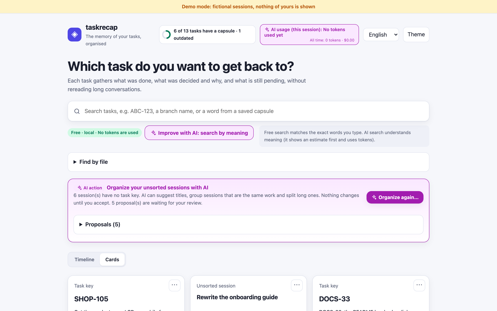
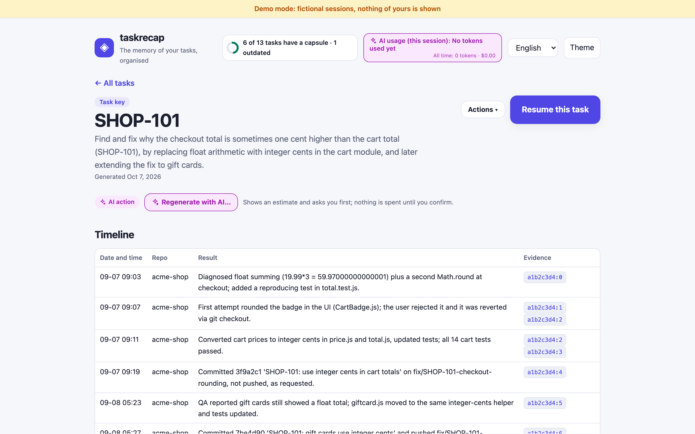
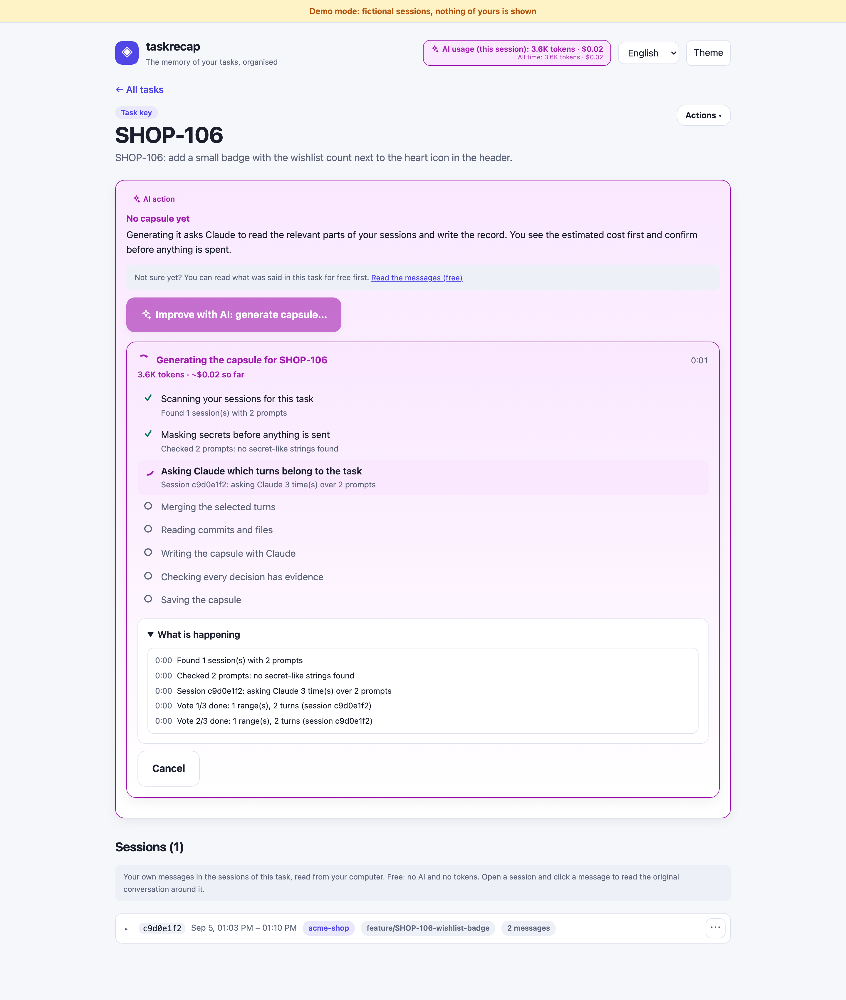
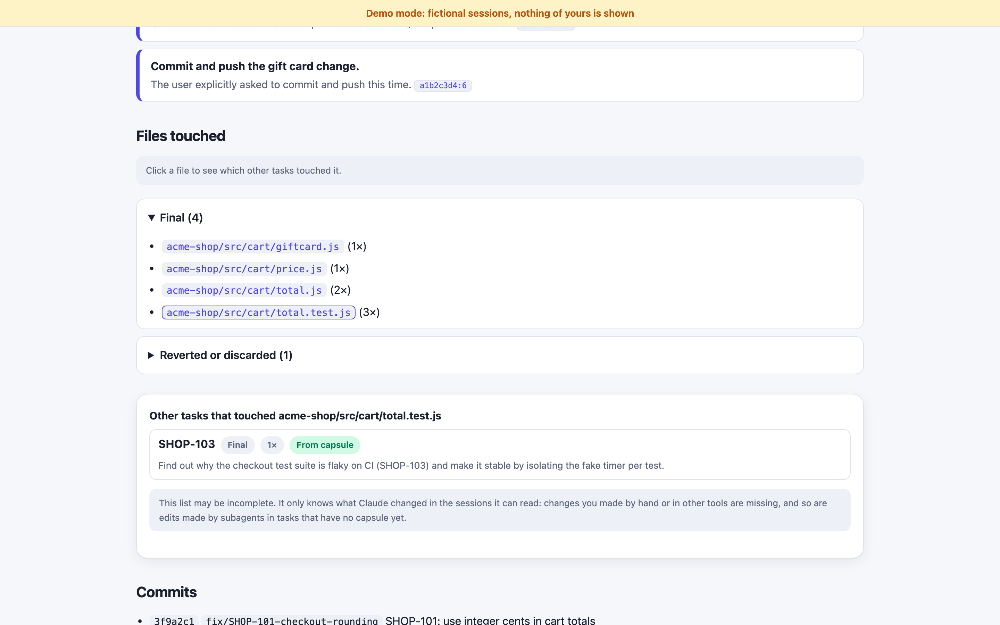

# taskrecap

**One living record per task, built from your Claude Code sessions.**

You work on several repos, each with many tasks. Weeks later you need to know *what was done in that task, what was decided and why, and what is still pending*, and the answer is scattered across dozens of Claude conversations. taskrecap reads your local sessions, groups them by task, and writes a **capsule**: objective, timeline, decisions with their reasons, files and commits, dead ends, what was left out, what is pending, and a briefing you can paste into a fresh Claude session to pick the task up again.



<table>
  <tr>
    <td width="50%"></td>
    <td width="50%"></td>
  </tr>
  <tr>
    <td></td>
    <td></td>
  </tr>
</table>

<sub>All screenshots use the built-in fictional demo data (`taskrecap --demo`). The AI progress screenshot is taken from a scripted stream, so no tokens are spent producing it. Dark theme is supported too.</sub>

## Quickstart

```bash
npx taskrecap --demo     # try it with fictional sessions: nothing of yours is shown
npx taskrecap            # your real sessions: opens http://127.0.0.1:8765
```

Or install it once:

```bash
npm install -g taskrecap
taskrecap
```

Requires Node 18+ and, only to *generate* capsules or use AI search, [Claude Code](https://claude.com/claude-code) logged in. No other dependencies.

```bash
taskrecap list               # tasks detected in your sessions
taskrecap generate ABC-123   # one capsule from the terminal (asks before spending)
taskrecap --help
```

## How it is different

Existing tools (history viewers, session browsers, search UIs) treat a session as a **conversation to read**. taskrecap treats the **task** as the unit and gives you the *distilled result*:

| Viewer / search tools | taskrecap |
|---|---|
| Browse and search chats | One record per task, across sessions and repos |
| You reread the conversation | Decisions and the *why*, each one citing the session turn it came from |
| Resume the old, heavy chat | Resume with a clean briefing in a **new** session |

## Two modes: free and AI

The dashboard keeps what is free apart from what uses tokens, and always tells you which is which.

| | Normal mode | ✨ AI mode ("Improve with AI") |
|---|---|---|
| Cost | **Free, 100% local** | Uses tokens from your own Claude login |
| Browse tasks, open saved capsules, copy a briefing | ✅ | |
| Search | **Literal**: every word you type must appear in a task name, repo, first prompt or saved capsule text | **By meaning**: "payment retry" can find a task about "checkout resubmit" |
| Write a capsule | | ✅ "Generate capsule" |

Every AI action shows an **estimate (tokens and dollars) first and needs your confirmation**. Afterwards it shows the real usage. A counter in the header keeps the tokens and dollars spent since the app started, plus an all-time total (kept in `~/.taskrecap/usage.json`).

## Privacy

- Everything runs **locally**. The dashboard binds to `127.0.0.1` only and rejects requests from other sites.
- Your sessions are read from `~/.claude/projects` and never uploaded by this tool.
- The only network use is the `claude -p` call that **you confirm**, using your own Claude Code login (no API keys). Before that call, secrets (tokens, passwords, keys) are redacted from the text sent.
- Capsules are cached in `~/.taskrecap/` (nothing is written inside your Claude folders).
- Capsules may still contain sensitive details from your work. Treat them like your sessions.

## How task detection works

Each session gets a task key, in layers, and the tool **never invents one**:

1. A key found in the git branch name (default pattern `ABC-123`, Jira style).
2. The most frequent key in your prompts and commit commands.
3. The branch name itself, when it is not `main`/`master`/`develop`.
4. Otherwise the session is shown as **unassigned**.

The key pattern is just a regex: `--key-regex` or `TASKRECAP_KEY_REGEX` (for example `#\d+` for GitHub issues). There is no Jira dependency.

Real sessions often mix several tasks, so for a key cited inside a longer session the tool asks Claude (3 votes, union of the answers, for stability) which turns belong to the task. Cheap heuristics (time gaps, new keys, topic shift) propose the candidate boundaries.

## How cost works

A capsule takes 1 call to write plus, for multi-task sessions, up to 3 short calls to pick the turns. In our tests a task cost roughly **$0.05 to $0.40**, and an AI search a few cents. The estimate shown before you confirm is rough; the real usage is shown afterwards. Results are cached on disk, so viewing a capsule is free. `--votes 1` is cheaper but less stable.

## Options

| Flag | Meaning |
|---|---|
| `--demo` | use the built-in fictional sessions |
| `--port <n>` | dashboard port (default 8765; the next free one is used if busy) |
| `--projects-dir <dir>` | where Claude Code stores sessions (default `~/.claude/projects`, or `$CLAUDE_CONFIG_DIR/projects`) |
| `--key-regex <regex>` | what a task key looks like |
| `--no-open` | do not open the browser |
| `--lang <code>` | UI language (see CONTRIBUTING) |
| `--votes <n>`, `--model <name>` | generation settings |

Environment: `TASKRECAP_HOME`, `TASKRECAP_PROJECTS_DIR`, `TASKRECAP_KEY_REGEX`, `TASKRECAP_CLAUDE_BIN`.

## Honest limitations

- **Claude Code's session format is not documented** and can change. If a Claude Code update breaks parsing, please open an issue with the version.
- Tested so far on a small number of real sessions from one developer. Detection quality on other workflows is the biggest unknown, so feedback is very welcome.
- Sessions with no task key and no feature branch stay **unassigned** and cannot be turned into a capsule yet.
- The "reverted" and "possibly undone" marks are heuristics; git history is not read.
- Commits you make in another terminal are not seen (only those that appear in the sessions).
- The LLM can still misread evidence. Decisions without a valid citation are dropped, and every decision shows its citation, but you should verify what matters.
- The UI is English only for now (translatable, see CONTRIBUTING).

## Roadmap

- Optional connectors that add title and status to a task: Jira, GitHub Issues, Linear.
- Read git history to confirm commits and reverts.
- Task detection that needs no key at all (topic clustering across sessions).
- Cross-task views: timeline of activity, files shared between tasks.
- Packaged as a Claude Code plugin as well.

## Development

```bash
npm test      # node:test; the LLM is always mocked, tests never spend tokens
npm run demo  # dashboard with the fictional sessions
```

See [CONTRIBUTING.md](CONTRIBUTING.md). MIT licensed.
