# Manual de usuario de taskrecap

taskrecap lee las sesiones que Claude Code guarda en tu equipo y las convierte en **fichas por tarea** (cápsulas): objetivo, línea de tiempo, decisiones con sus motivos, archivos y commits, callejones sin salida, lo que quedó fuera, lo que está pendiente y un resumen para retomar la tarea. Cada dato de una cápsula se puede verificar: las citas abren el mensaje original de la sesión.

Esta es la documentación de la interfaz web. Cubre las **dos páginas** de la aplicación —la página de **inicio** y la **ficha de tarea**— y todos los controles compartidos (barra superior, menú de acciones, diálogos, panel de evidencia y avisos).

## Cómo abrir la interfaz

| Comando | Qué hace |
|---|---|
| `npx taskrecap` | Abre tus **sesiones reales** en `http://127.0.0.1:8765` (o el siguiente puerto libre). |
| `npx taskrecap --demo` | Abre una demo con **sesiones ficticias** de ejemplo; no muestra nada tuyo. |
| `npx taskrecap --port 9000` | Usa un puerto concreto. |

La interfaz es local: nada se sube a ningún sitio y las cápsulas se guardan en `~/.taskrecap/`.

## Cómo leer este manual

- Las capturas usan **datos sintéticos de la demo** (`acme-shop`, `acme-docs`, `acme-api`).
- Los **recuadros rojos numerados** marcan el elemento concreto que documenta cada imagen; el número se explica en la leyenda que aparece en la propia captura.
- La interfaz admite **tema claro y oscuro** (botón de tema en la barra superior).
- Los nombres de botones y etiquetas citados son los que se ven en pantalla en español.

## Contenido

1. **La página de inicio** — búsqueda dentro de las cápsulas, buscar por archivo, barra de vistas, vista de Tarjetas, menú de acciones, línea de tiempo, estados vacíos y grupos plegados, y las acciones de IA desde el inicio.
2. **Ficha de tarea (página de detalle)** — encabezado, línea de tiempo, decisiones, archivos, commits, cierre, resumen para retomar, citas y evidencia, sesiones, cápsula desactualizada y generación con IA.
3. **Interfaz común** — barra superior (cobertura, uso, idioma, tema, banner), menú de acciones de la unidad (⋯), diálogos (renombrar, unir, mover, ocultar), Organizar con IA, panel de evidencia, avisos y comportamiento general.

---

## La página de inicio

La página de inicio es el punto de partida de taskrecap: muestra todas tus tareas como *unidades de trabajo* y te deja buscar dentro de las cápsulas ya guardadas, mirar el trabajo en el tiempo, buscar por archivo y organizar con IA lo que aún no tiene nombre. Lo que no usa IA es gratis y local; lo que usa IA siempre muestra antes una estimación y pide confirmación.

El encabezado de la página (título «¿A qué tarea quieres volver?» y la frase de introducción) es texto fijo, no un control.

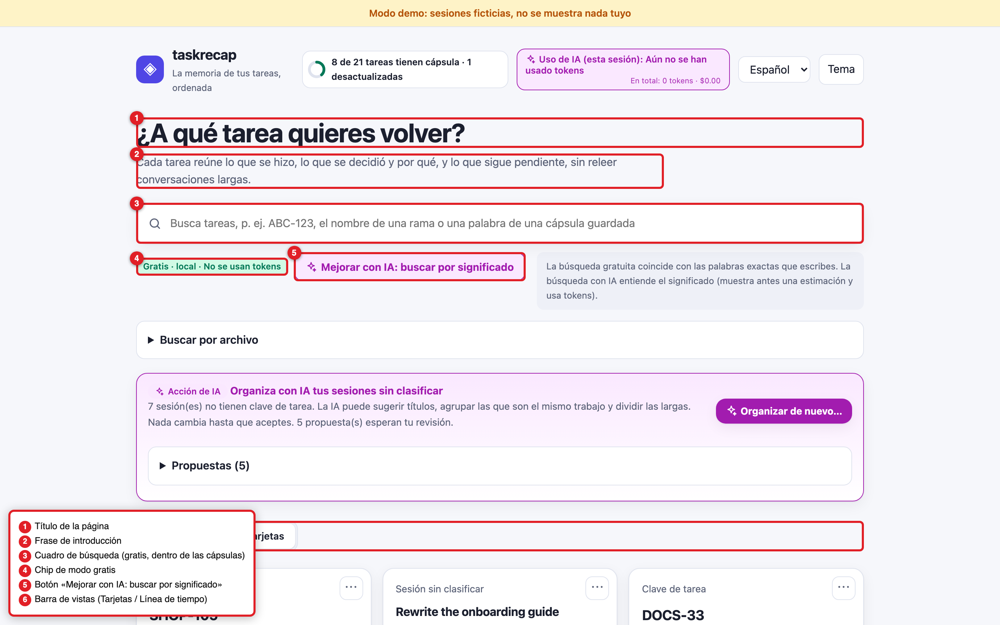

> El encabezado común (banner de modo demo/local, idioma, tema y contador de uso), los diálogos y el panel de evidencia se documentan en `manual-usuario.md`, sección «Interfaz común».

### Búsqueda dentro de las cápsulas

El cuadro de búsqueda `#q` está justo debajo de la introducción. Su texto de ayuda es «Busca tareas, p. ej. ABC-123, el nombre de una rama o una palabra de una cápsula guardada», y su etiqueta accesible es «Buscar una tarea».

| Control | Etiqueta visible | Qué hace al usarlo |
|---|---|---|
| `#q` | (campo de texto) | Filtra las tarjetas en vivo. Escribe y, tras ~150 ms, la lista se actualiza. |
| `#mode-free` | Chip «Gratis · local · No se usan tokens» | Solo informa: indica que esta búsqueda no gasta tokens. |
| `#ai-search` | Botón «Mejorar con IA: buscar por significado» | Abre la búsqueda con IA (ver más abajo). |
| `#search-note` | «La búsqueda gratuita coincide con las palabras exactas que escribes. La búsqueda con IA entiende el significado (muestra antes una estimación y usa tokens).» | Nota fija. |
| `#ai-note` | (solo si falta Claude Code) | Muestra el aviso de que las acciones con IA no están disponibles y un botón «Comprobar de nuevo». |
| `#search-scope` | p. ej. «La búsqueda gratuita miró dentro de N cápsula(s) guardada(s)…» | Aparece solo mientras hay búsqueda activa y dice dentro de cuántas cápsulas se buscó. |

**Qué encuentra la búsqueda gratuita.** Es literal (no distingue mayúsculas ni tildes) y mira: el nombre de la tarea, sus repos, su primer prompt y el texto de las cápsulas guardadas. Cuando coincide dentro de una cápsula, la tarjeta muestra la etiqueta **«Encontrado en …»** (por ejemplo «Encontrado en Objetivo», «Encontrado en Decisiones y por qué», «Encontrado en Pendiente», etc.), un extracto y las palabras exactas resaltadas con un recuadro. Si solo coincide por nombre, repos o primer prompt, muestra «Coincide con el nombre de la tarea, los repos o el primer prompt». Las tareas sin cápsula solo se pueden encontrar por nombre, repo y primer prompt.

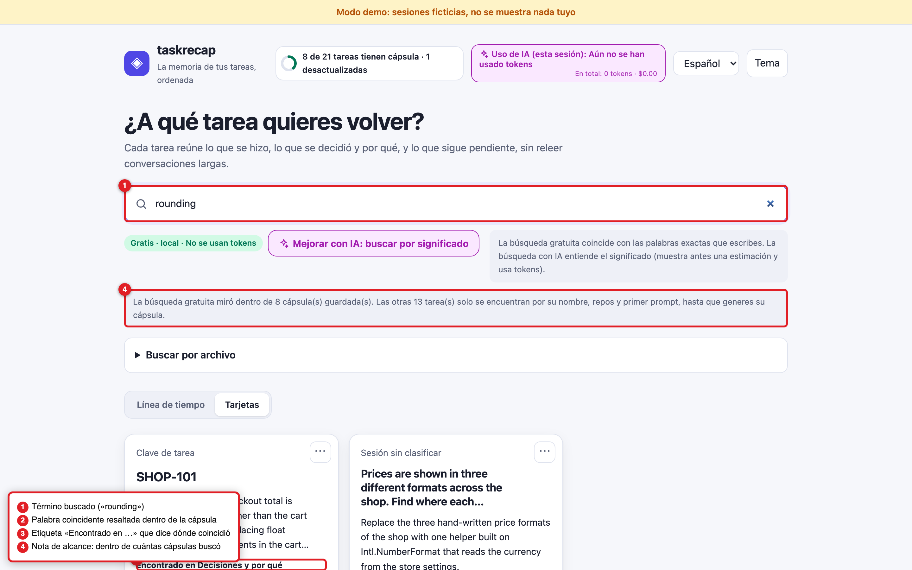

Llamada de fondo: `GET /api/search?q=`. No gastas nada.

**Búsqueda con IA (por significado).** El botón `#ai-search` inicia una búsqueda que entiende la idea, no las palabras exactas. Primero pide una estimación gratuita (`GET /api/ai-search/estimate`) y muestra un panel con la estimación de tokens y coste; solo al pulsar «Confirmar y generar» se gasta (`POST /api/ai-search`). Si el campo está vacío, avisa «Escribe primero lo que buscas.». Los resultados de IA aparecen en una sección aparte, con el título «Resultados de la IA para «…»», la lista de tareas y un enlace «Borrar resultados de la IA». Los resultados de IA no se pueden ver si Claude Code no está disponible (el botón queda desactivado y explica por qué).

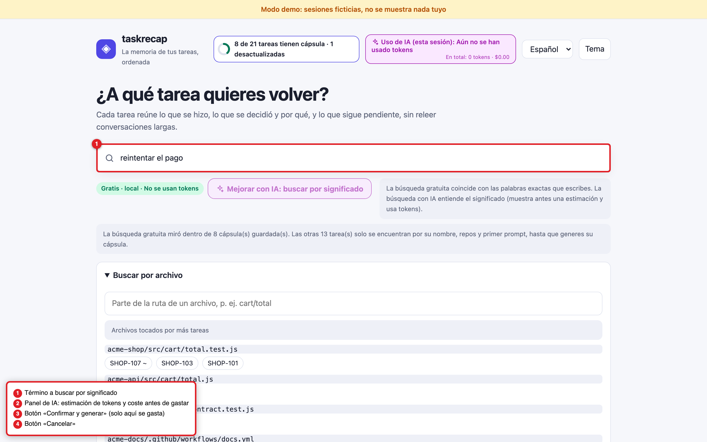

### Buscar por archivo

`
` es un desplegable plegado por defecto, con el título **«Buscar por archivo»**. Se abre y se cierra haciendo clic en ese título. Dentro hay:

| Control | Etiqueta / texto | Qué hace |
|---|---|---|
| `#fq` | Campo con ayuda «Parte de la ruta de un archivo, p. ej. cart/total» y etiqueta «Buscar archivos» | Filtra los archivos; espera ~150 ms antes de consultar. |
| `#filelist` | «Archivos tocados por más tareas» (sin texto) o «N de M archivo(s)» (con texto) | Lista de archivos y, junto a cada uno, botones con las tareas que lo tocaron. Un chip «~» marca las relaciones aproximadas. |

Al abrir por primera vez se carga la lista (`GET /api/files?q=`). Hacer clic en una tarea de la lista abre su detalle.

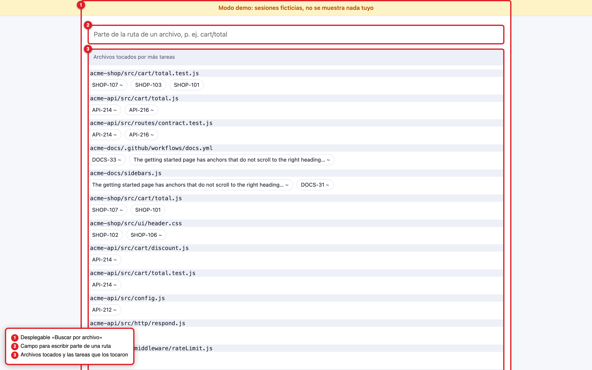

### Barra de vistas

La barra `#viewbar` contiene un control segmentado con dos pestañas (etiqueta «Vista de inicio»):

| Pestaña | Qué muestra |
|---|---|
| `#view-timeline` — **«Línea de tiempo»** | Una fila por tarea con puntos por día. Es la vista predeterminada. |
| `#view-cards` — **«Tarjetas»** | Una tarjeta por tarea en una rejilla. |

Cambiar de pestaña guarda tu elección en el navegador (clave `tr-view`) y vuelve a dibujar la página; la elección se recuerda en la próxima visita. La barra solo aparece cuando hay tareas.

### Vista de Tarjetas

La rejilla `#grid` muestra una tarjeta por unidad de trabajo. Toda la tarjeta es un botón: al hacer clic se abre la página de detalle de esa tarea.

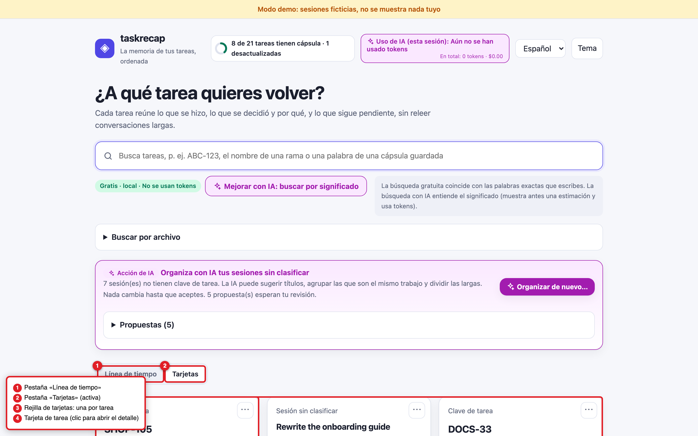

Cada tarjeta tiene:

- **Rótulo de tipo** (`kind_…`): «Clave de tarea», «Rama», «Sesión sin clasificar» o «Grupo tuyo»; si le pusiste un nombre a mano, aparece también la clave.
- **Nombre de la tarea** (el título, o el nombre del grupo, o el nombre propio si es una sesión suelta).
- **Resumen**: el objetivo (si la cápsula lo tiene) o el fragmento/primer mensaje.
- **Fila de chips** (`meta`):
  - hasta tres chips de **repo**;
  - chips de origen de la unidad: «Sin clasificar» o «Grupo tuyo»; si la unidad es un tramo de sesión, «mensajes A–B»; si la creó la IA, «Organizado con IA»;
  - número de **sesiones**;
  - rango de **fechas**;
  - estado de la cápsula: **«Cápsula lista»** (verde) o **«Aún sin cápsula»** (ámbar), solo para unidades que se pueden generar;
  - si la cápsula quedó obsoleta: **«Desactualizada · N nuevos»** (o «Desactualizada · unidad cambiada»), con el detalle en el globo al pasar el ratón.
- Línea **«Relacionadas: …»** cuando hay otras tareas del mismo repo escritas con menos de 2 horas de diferencia; es solo una pista, no agrupa nada.

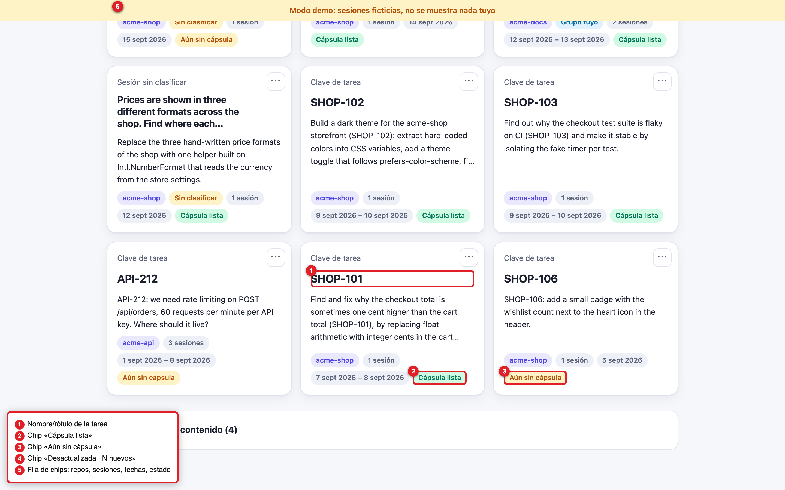

### Menú de acciones de una unidad

Las tarjetas y las filas de la línea de tiempo muestran un botón **«⋯»** (`#grid .cardmenu` y `.lanemenu`). Al pulsarlo se abre el menú flotante `#unitmenu` (role `menu`), que se cierra con `Escape`, con `Tab`, o al hacer clic fuera. Los elementos que pueden aparecer en la página de inicio son:

| Elemento | Efecto |
|---|---|
| **«Renombrar…»** | Abre un diálogo para poner un nombre propio a la unidad (vacío = volver al automático). |
| **«Unir con…»** | Abre un diálogo para unir esta unidad con otra en un solo grupo. |
| **«Mover sesión…»** | Solo si la unidad es una única sesión: mueve esa sesión a otra unidad o a un grupo nuevo. |
| **«Separar grupo»** | Solo en grupos: disuelve el grupo y devuelve cada sesión a su sitio. |
| **«Poner nombre con IA…»** | Solo en sesiones sin clasificar con contenido: propone un nombre con IA (con estimación y confirmación). |
| **«Ocultar»** / **«Mostrar de nuevo»** | Oculta la unidad de la lista, la línea de tiempo y los recuentos, o la vuelve a mostrar. |
| **«Deshacer el último cambio (…»** / «Nada que deshacer» | Deshace la última corrección; aparece desactivado si no hay nada que deshacer. |

Todas las correcciones son locales, gratuitas y se pueden deshacer. El menú y sus diálogos se describen con más detalle en `manual-usuario.md`, sección «Menú de acciones de la unidad (⋯)».

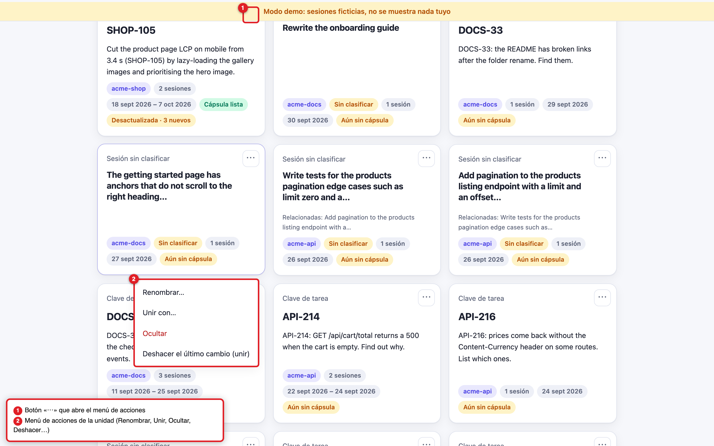

### Línea de tiempo

La sección `#timeline` (título **«Línea de tiempo de tareas»**) es la vista predeterminada. Una fila por tarea; cada **punto** es un día con prompts en sus sesiones y su tamaño indica cuántos prompts hubo. El color del punto corresponde al repo (leyenda **«Repos»**; los que sobran se agrupan como «Otros repos»). La línea fina solo une el primer y el último día, no representa tiempo trabajado. Las fechas son aproximadas: una sesión que mezcla varias tareas cuenta para cada una.

- **Abrir una tarea**: hacer clic en el punto o en la etiqueta de la fila. La etiqueta muestra un «✓» si hay cápsula y un «↻» si está desactualizada.
- **Ratón**: al pasar por encima de un punto o de la etiqueta aparece el globo `#vz-tip` con repo, día, número de prompts y estado de la cápsula.
- **Teclado**: la etiqueta de la fila es el punto de tabulación. Con las flechas `←`/`→` y `Inicio`/`Fin` te mueves entre los días de esa fila; `Enter` o `Espacio` abren la tarea.
- **Pie**: «Mostrando X de Y tareas», más «N sesiones sin contenido están plegadas abajo» y «N sin actividad con fecha no aparecen en la línea de tiempo» cuando corresponde.

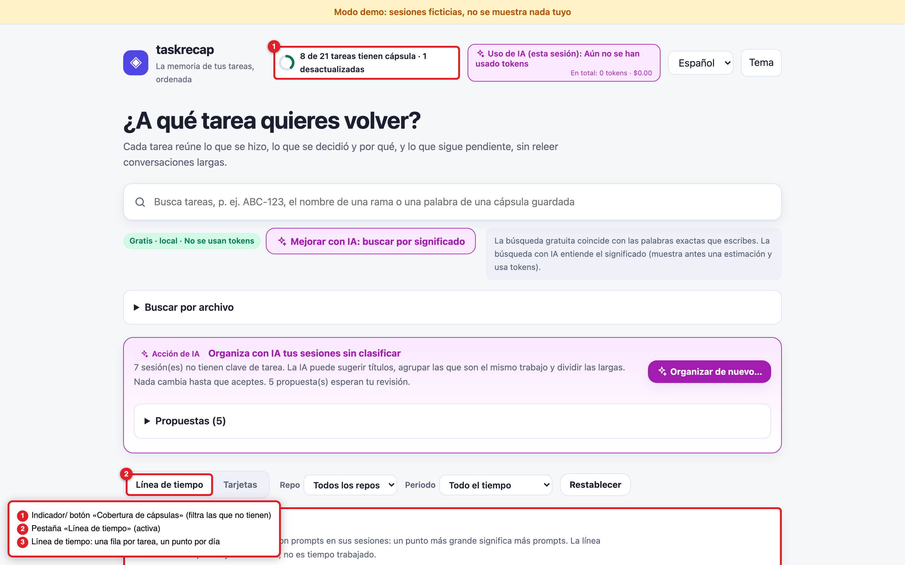

#### Filtros de la línea de tiempo

En la barra de vistas, cuando estás en la línea de tiempo, aparecen los filtros:

| Control | Etiqueta visible | Qué hace |
|---|---|---|
| `#vz-repo` | «Repo» | Filtra por repositorio; «Todos los repos» los muestra todos. Al cambiar se vuelve al límite inicial. |
| `#vz-period` | «Periodo» | Opciones: **«Todo el tiempo»**, **«Últimos 7 días»**, **«Últimos 30 días»**, **«Últimos 90 días»**, **«Rango personalizado…»**. |
| `#vz-from` / `#vz-to` | «Desde» / «Hasta» | Solo con «Rango personalizado…». Si «Desde» es posterior a «Hasta», se intercambian y aparece el aviso. |
| `#vz-reset` | «Restablecer» | Vuelve a «Todos los repos», «Todo el tiempo» y sin rango. |
| `#vz-msg` | (aviso) | Muestra ««Desde» era posterior a «Hasta», así que se intercambiaron las dos fechas.» cuando se cruzan las fechas. |
| `#coverage` | Botón/indicador «Cobertura de cápsulas», p. ej. «4 de 9 tareas tienen cápsula» | Al pulsarlo, lista solo las tareas **sin cápsula** (activa el filtro de cobertura). |
| `#capfilter` + `#capfilter-clear` | «Mostrando solo las tareas sin cápsula» + «Mostrar todas las tareas» | Chip que aparece con el filtro de cobertura activo y su botón para quitarlo. |

Cada cambio de filtro vuelve a consultar `GET /api/timeline`. Si el filtro no deja ninguna fila, se muestra «Ninguna actividad con fecha coincide con estos filtros.» con un botón «Restablecer filtros».

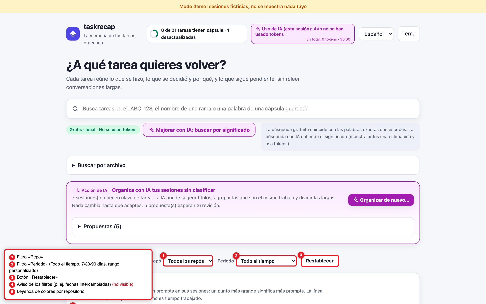

Cuando hay más tareas que el límite inicial (12), aparece el botón **«Mostrar N más»** (`#vz-more`), que carga 12 más cada vez.

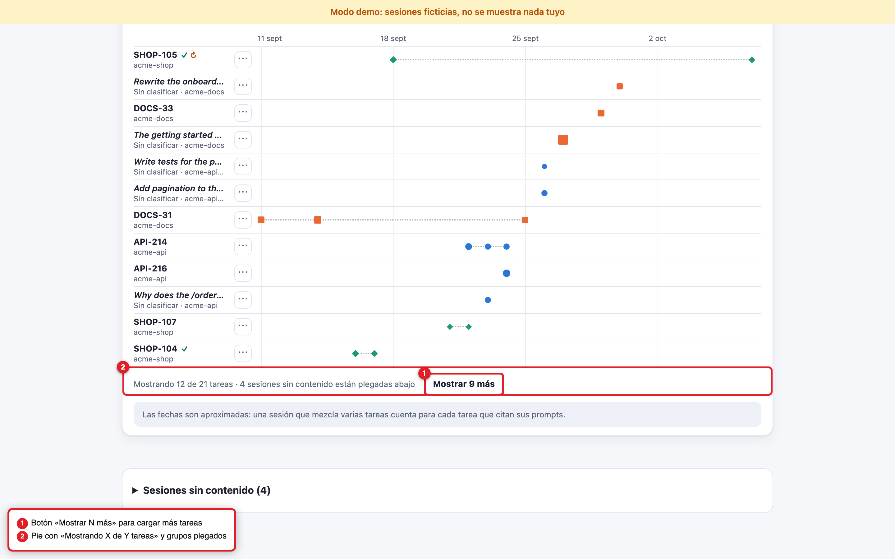

### Estados vacíos y grupos plegados

| Elemento | Cuándo aparece | Contenido |
|---|---|---|
| `#loading` | Al cargar la página | «Cargando…». |
| `#nonewrap` → `#none` | No hay resultados (en Tarjetas) o la búsqueda no deja tareas reales (en Línea de tiempo) | «Ninguna tarea coincide con tu búsqueda.» o, si no hay ninguna sesión, «No se encontraron sesiones de Claude Code…». |
| `#none-hint` + `#none-ai` | Solo cuando la búsqueda gratuita no encontró nada | Explica que la búsqueda es literal y ofrece el botón «Probar la búsqueda por significado con IA…». |
| `#emptygroup` | Hay sesiones sin contenido (solo saludos, comandos o notas del editor) | Un grupo plegado **«Sesiones sin contenido (N)»** con una fila por sesión; se puede desplegar y replegar. |
| `#hiddenbox` | Hay unidades o sesiones ocultas | Un grupo plegado **«Ocultos (N)»** con un botón «Mostrar de nuevo» en cada uno. |

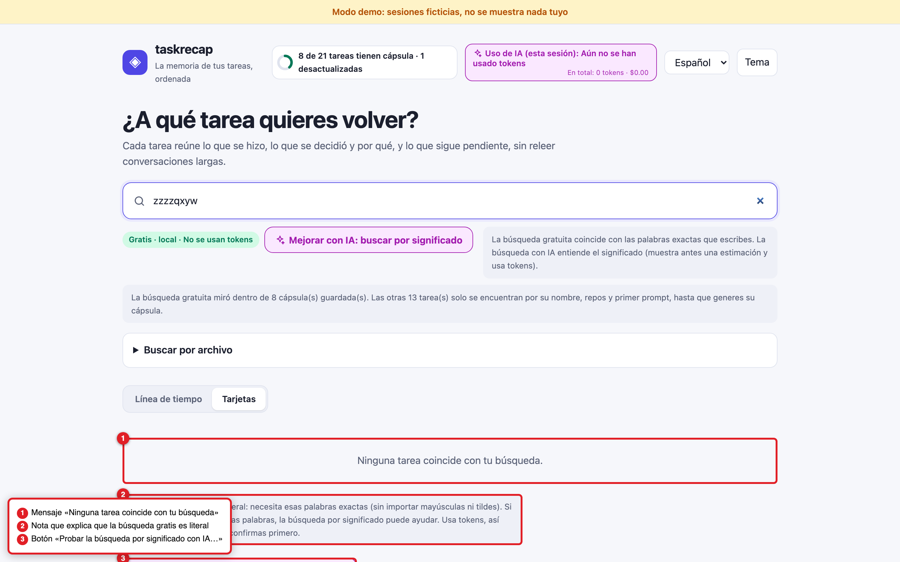

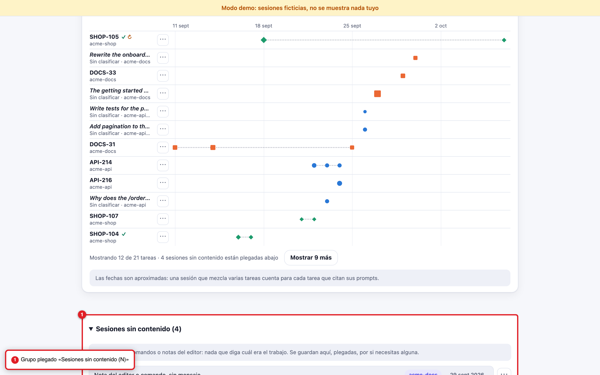

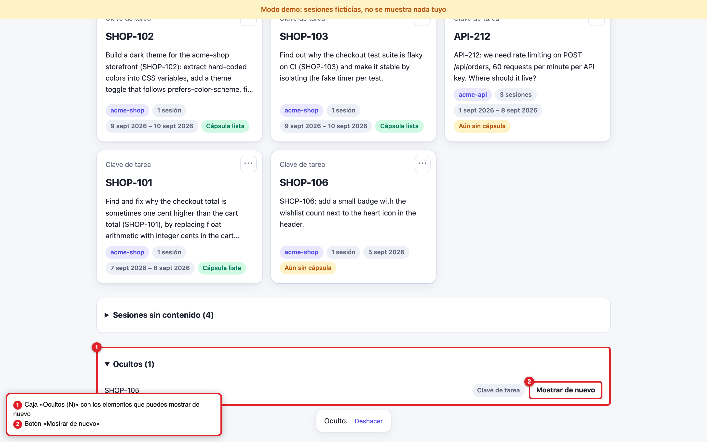

### Acciones de IA desde la página de inicio

Todas las acciones de IA comparten la misma regla: **primero una estimación gratuita y una confirmación; nada se gasta hasta que confirmas**; después se muestra el uso real y el contador del encabezado. Desde la página de inicio puedes iniciar:

- **Búsqueda por significado** (`#ai-search` o `#none-ai`): descrita arriba.
- **Organizar con IA** (`#organize`): el panel **«Organiza con IA tus sesiones sin clasificar»** aparece cuando hay sesiones sin clave de tarea. El botón **«Organizar con IA…»** (o «Organizar de nuevo…») pide la estimación y confirma antes de gastar. Lo que devuelve son *propuestas* (título, agrupar, dividir), que no cambian nada hasta que las aceptas. La lista de propuestas se puede desplegar en la propia página.

Si Claude Code no está disponible, los botones de IA quedan desactivados y el aviso `#ai-note` indica cómo comprobarlo o instalarlo; la navegación, la línea de tiempo y la búsqueda gratuita siguen funcionando. El flujo completo de IA (progreso, cancelar, propuestas) se detalla en `manual-usuario.md`, secciones «Acciones de IA desde la página de inicio», «Generar o regenerar con IA» y «Organizar con IA».

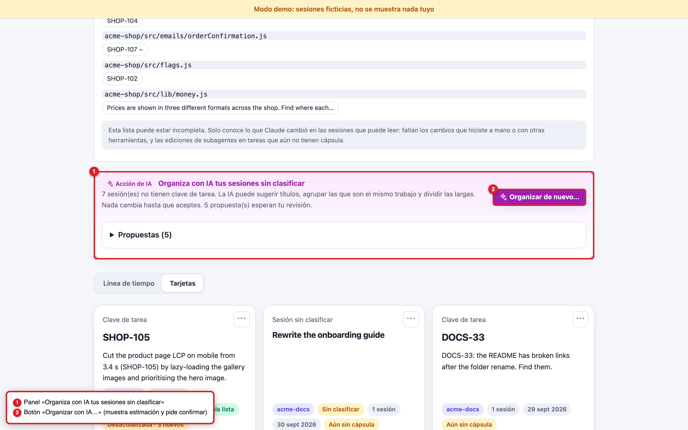

## Ficha de tarea (página de detalle)

La página de detalle muestra **una unidad de trabajo**: una clave de tarea, una rama, una sesión suelta o un grupo creado por ti. Reúne su objetivo, lo que se hizo, lo que se decidió y lo que queda pendiente, y ofrece las sesiones y las acciones de IA. Todo lo que no lleva el sello «Acción de IA» es **gratis y local**: no usa tokens.

El menú de acciones y el panel de evidencia son zonas compartidas con la página de inicio; aquí solo se resumen y se enlazan a las secciones **Menú de acciones de la unidad (⋯)** y **Panel de evidencia** de `manual-usuario.md`.

### Cómo se llega y cómo se vuelve

| Acción | Cómo | Efecto |
| --- | --- | --- |
| Abrir una ficha | Clic en una tarjeta o en una franja de la línea de tiempo del inicio | Cambia la dirección a `#/task/<unidad>` y carga el detalle |
| Volver | Botón **← Todas las tareas** (`#back`) o el botón Atrás del navegador | Vuelve a la página de inicio |
| Saltar al contenido | Enlace **Saltar al contenido principal** | Pone el foco en el encabezado de la página |

Al entrar se muestra **Cargando…** mientras llegan los datos.

### Encabezado de la cápsula

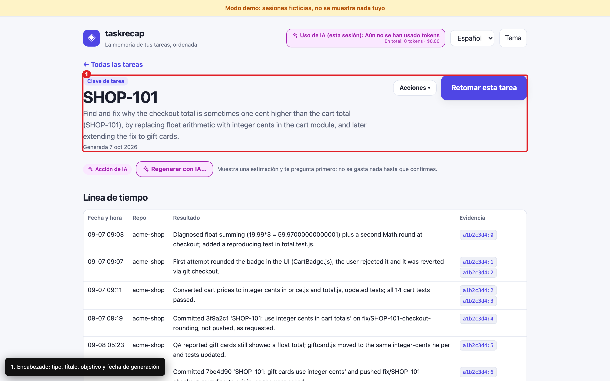

- **Chip de tipo de unidad** (esquina del encabezado), según la clase de unidad: **Clave de tarea** (`key`), **Rama** (`branch`), **Sesión sin clasificar** (`session`) o **Grupo tuyo** (`user`). Si la unidad fue renombrada y no es un grupo, aparece además un chip con la clave original.
- **Título** (`h1`): el nombre de la unidad. En una sesión sin título propio se usa «Sesión corta en <repo> · <fecha>».
- **Objetivo**: el texto bajo el título. Sale de la cápsula; si aún no hay cápsula, es el primer fragmento de la sesión.
- **Fecha de generación**: «Generada <fecha>», solo cuando ya existe cápsula.
- **Acciones ▾**: abre el menú de correcciones (renombrar, unir, mover, separar, ocultar, deshacer). Ver **Menú de acciones**.
- **Retomar esta tarea**: copia el resumen para retomar y muestra «¡Copiado! Pégalo en una sesión nueva de Claude». Si el portapapeles está bloqueado, selecciona el texto para copiarlo a mano.

El chip **Organizado con IA** que indica el origen de la unidad se muestra en las tarjetas y franjas del inicio (§ inicio), no en este encabezado.

### Línea de tiempo

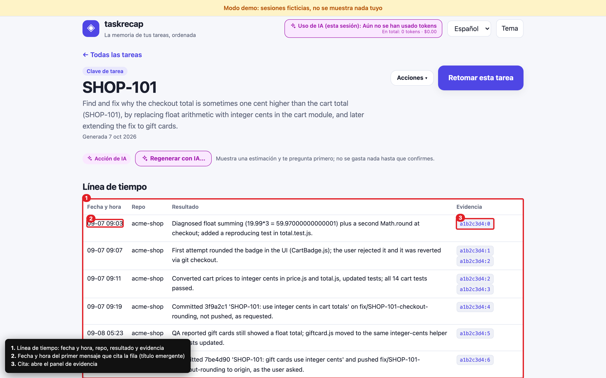

Tabla con una fila por hito (heading **Línea de tiempo**):

| Columna | Contenido |
| --- | --- |
| **Fecha y hora** | Fecha del hito y hora local del primer mensaje que cita la fila. El título emergente dice «Hora local del primer mensaje que cita esta fila». Si no se conoce la hora, solo aparece la fecha |
| **Repo** | Repositorio donde ocurrió |
| **Resultado** | Qué se consiguió en ese paso |
| **Evidencia** | Una o más citas clicables (ver más abajo) |

Si la cápsula no tiene línea de tiempo, muestra **Ninguno**.

### Decisiones y por qué

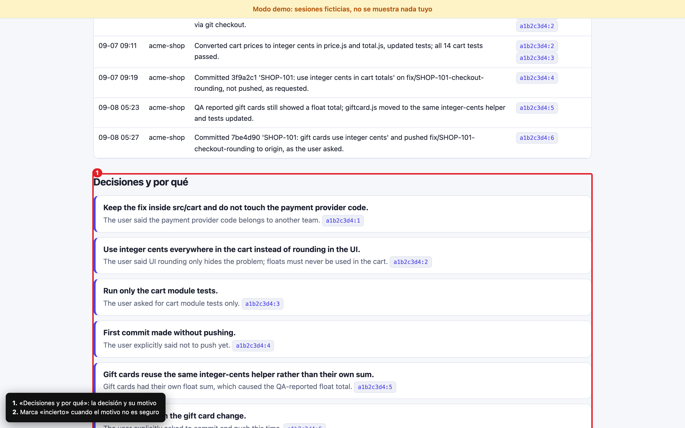

Lista de decisiones (heading **Decisiones y por qué**). Cada entrada muestra la **decisión** en negrita y, debajo, el **motivo**. Si no se encontró el motivo en la evidencia, dice «no se encontró el motivo en la evidencia». La marca **incierto** señala una decisión cuya razón no es segura. Cada entrada lleva su cita de evidencia.

### Archivos tocados

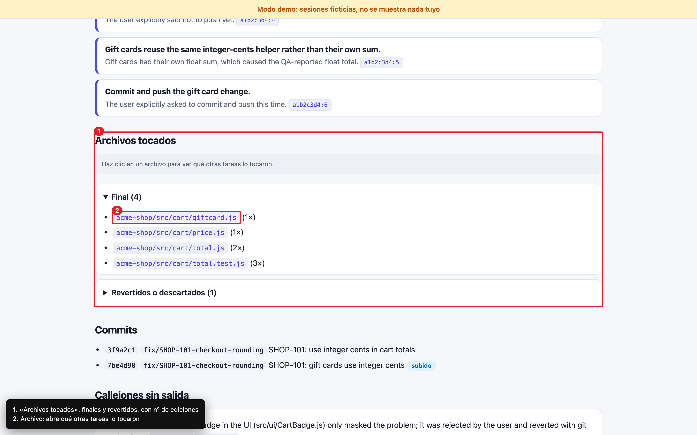

Heading **Archivos tocados**, con la nota «Haz clic en un archivo para ver qué otras tareas lo tocaron».

- **Final (N)**: archivos que quedaron en el resultado, con el número de ediciones (`N×`). Desplegable abierto por defecto.
- **Revertidos o descartados (N)**: archivos que se deshicieron, si los hay.
- Cada nombre de archivo es un botón que abre el panel **Otras tareas que tocaron <archivo>** (ver más abajo).

### Commits

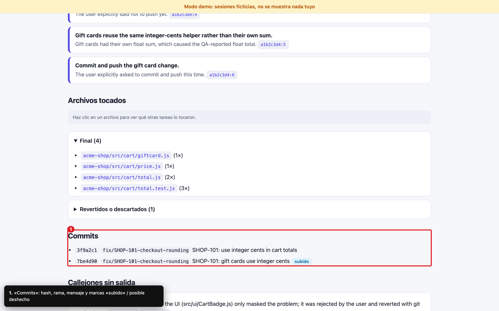

Heading **Commits**. Cada commit muestra `<hash> <rama> <mensaje>` y puede llevar las marcas **subido** (ya está en el remoto) o **¿posiblemente deshecho por un reset posterior?**. Los commits dudosos se agrupan en el desplegable **Misma ventana de tiempo, sin clave de tarea (podría ser de otra tarea)**.

### Callejones sin salida, dejado fuera y pendiente

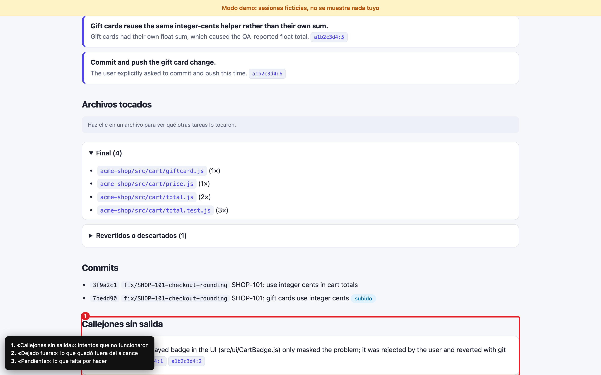

Tres secciones independientes, cada una con su lista y sus citas:

- **Callejones sin salida**: intentos que no funcionaron y por qué.
- **Dejado fuera**: lo que quedó fuera del alcance de la tarea.
- **Pendiente**: lo que aún falta por hacer.

Cada sección muestra **Ninguno** si está vacía.

### Resumen para retomar

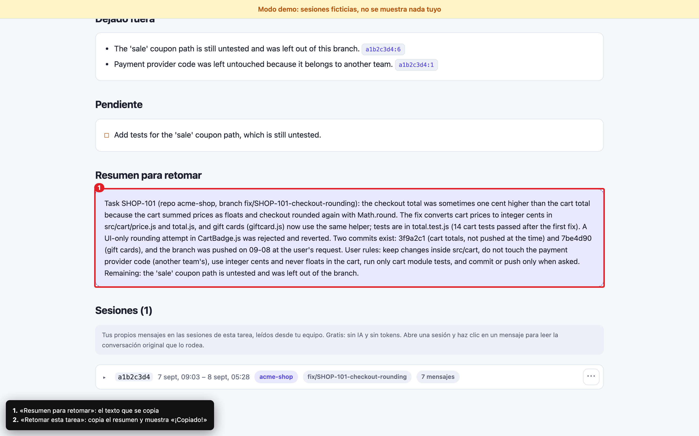

Heading **Resumen para retomar**: el briefing que se pega en una sesión nueva de Claude. El botón **Retomar esta tarea** del encabezado (o el mismo texto) lo copia al portapapeles. En el panel de evidencia también hay un comando **claude --resume …** con su propio botón de copia (ver **Panel de evidencia**).

### Citas y panel de evidencia

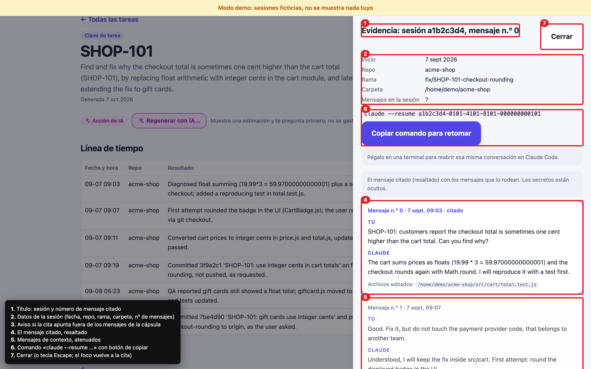

Cada cita (`sesión:turno`) es un botón que abre el **panel de evidencia**: el mensaje original detrás de esa afirmación, con los mensajes de alrededor como contexto. El panel resalta el **mensaje citado** y atenúa el **contexto**; si la cita apunta fuera de los mensajes con los que se escribió la cápsula, muestra el aviso **Esta cita apunta fuera de los mensajes con los que se escribió la cápsula, así que puede no ser la correcta**. Incluye los datos de la sesión, el comando `claude --resume …` para reabrirla y un botón de cierre. Se cierra con **Cerrar**, con **Escape** o con el fondo, y el foco vuelve a la cita que lo abrió. Detalle completo en **Panel de evidencia**.

### Archivo → otras tareas

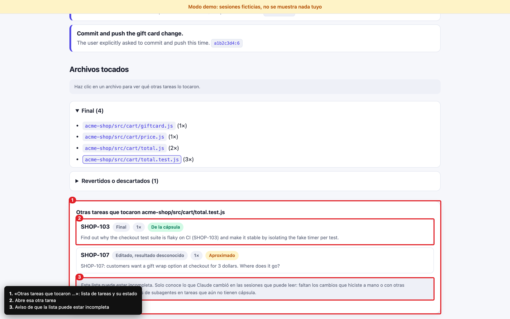

Al pulsar un archivo (`button.filelink`) se abre, dentro de la sección de archivos, el panel **Otras tareas que tocaron <archivo>**. Lista las demás unidades que editaron ese archivo, con su estado (**Final**, **Revertido** o **Editado, resultado desconocido**) y una insignia que indica si el dato viene **De la cápsula** o es **Aproximado**. Cada fila abre esa otra tarea. El aviso recuerda que la lista puede estar incompleta: solo ve lo que Claude cambió en las sesiones que puede leer.

### Sesiones (gratis)

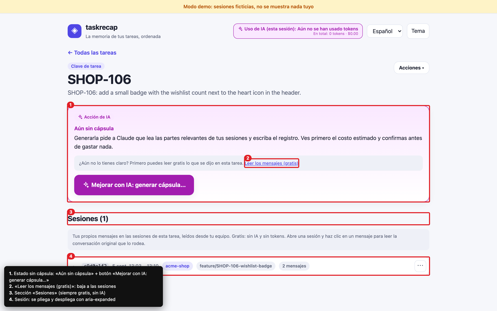

La sección **Sesiones** lista tus propios mensajes de la unidad, leídos del equipo. Es **gratis**: sin IA y sin tokens. Cuando todavía **no hay cápsula**, arriba se ve el estado **Aún sin cápsula** con el botón **Mejorar con IA: generar cápsula…**, y la pista **¿Aún no lo tienes claro? Primero puedes leer gratis lo que se dijo en esta tarea** con el botón **Leer los mensajes (gratis)**, que baja a esta lista.

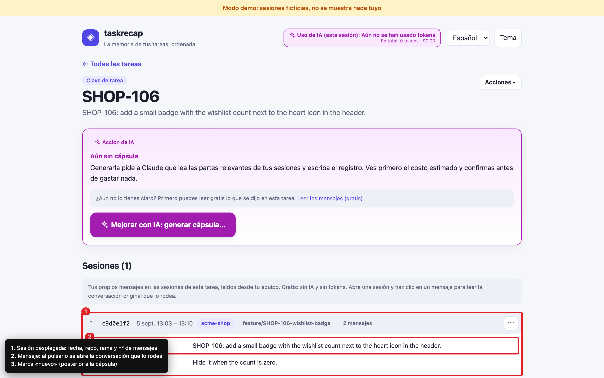

| Control | Qué hace |
| --- | --- |
| Fila de sesión (`.sessrow`) | Despliega o pliega sus mensajes (estado `aria-expanded`). Muestra fecha/hora, repo, rama y número de mensajes |
| Mensaje (`.msg`) | Abre el panel de evidencia con la conversación que lo rodea; al cerrar, el foco vuelve a ese mensaje |
| **Mostrar N más** | Carga la siguiente página de mensajes |
| **⋯** (menú de sesión) | Mueve u oculta esa sesión (ver **Menú de acciones**) |

### Sesión compartida, «míos» y alcance

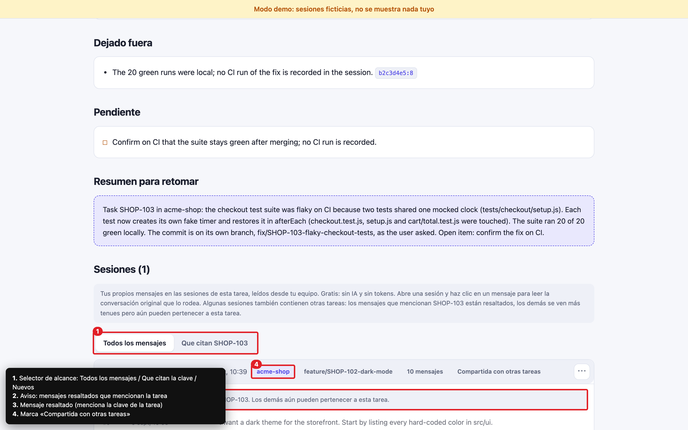

Si una sesión pertenece a varias tareas, se marca con **Compartida con otras tareas** y aparece un selector de alcance:

| Alcance | Qué muestra |
| --- | --- |
| **Todos los mensajes** | Todo lo que hay en la sesión; los mensajes que mencionan la clave quedan resaltados y el resto más tenue. El aviso explica que los no resaltados aún pueden pertenecer a la tarea |
| **Que citan <clave>** | Solo los mensajes que mencionan la clave de esta tarea |
| **Nuevos desde la cápsula (N)** | Solo los mensajes posteriores a la cápsula (ver más abajo) |

Los mensajes resaltados llevan la clase `.msg.mine` y, para lectores de pantalla, la etiqueta «menciona <clave>».

### Cápsula desactualizada

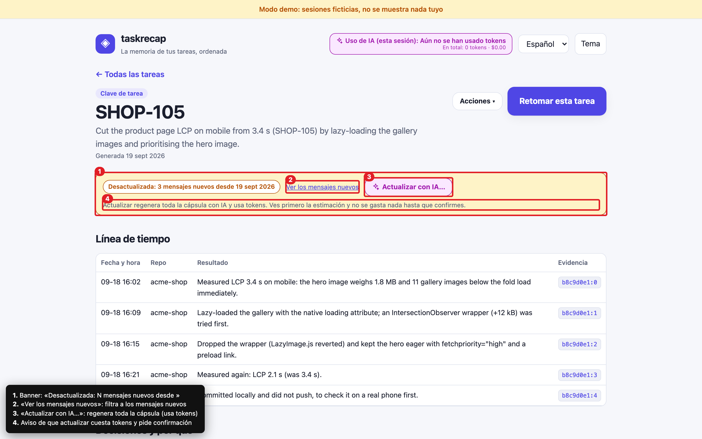

Cuando la unidad tiene mensajes posteriores a la cápsula (o cambió su composición), aparece el banner **Desactualizada: N mensajes nuevos desde <fecha>**:

- **Ver los mensajes nuevos**: filtra la lista de sesiones al alcance **Nuevos** y baja hasta ella.
- **Actualizar con IA…**: regenera **toda** la cápsula con IA. La nota lo advierte: «Actualizar regenera toda la cápsula con IA y usa tokens. Ves primero la estimación y no se gasta nada hasta que confirmes».
- Si la unidad cambió (unión, separación o movimiento), el banner lo indica con **Desactualizada: las sesiones de esta unidad cambiaron…** y, cuando existe, ofrece la cápsula anterior (**Existe una cápsula de antes del cambio** → **Reutilizar esa cápsula**), que copia esa cápsula y la marca como desactualizada hasta regenerarla.

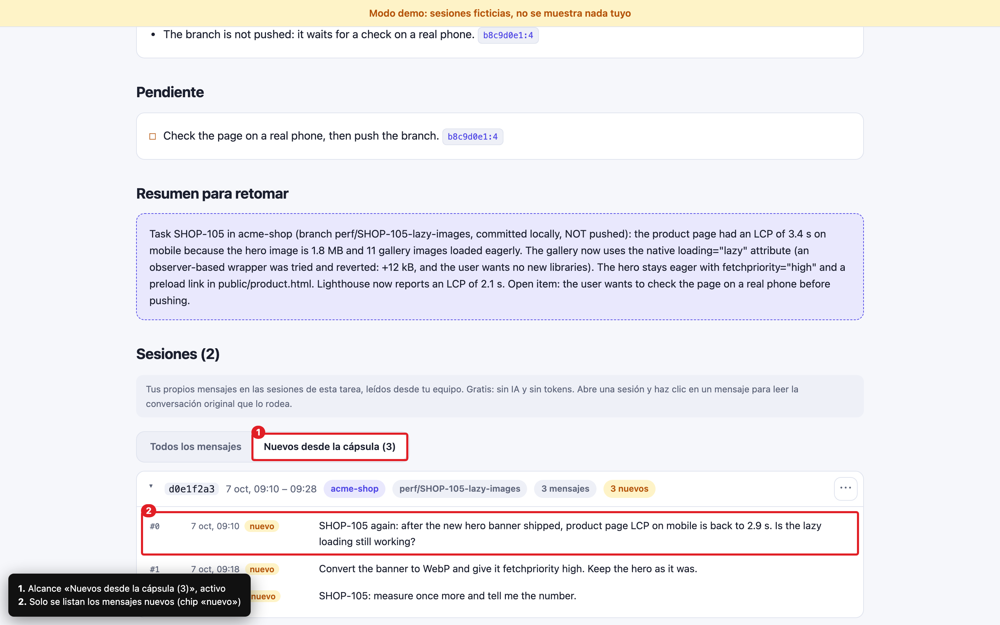

### Generar o regenerar con IA

El botón cambia según el estado: **Mejorar con IA: generar cápsula…** (sin cápsula), **Regenerar con IA…** (cápsula lista) o **Actualizar con IA…** (desactualizada). Todos piden primero una **estimación** y solo gastan al confirmar.

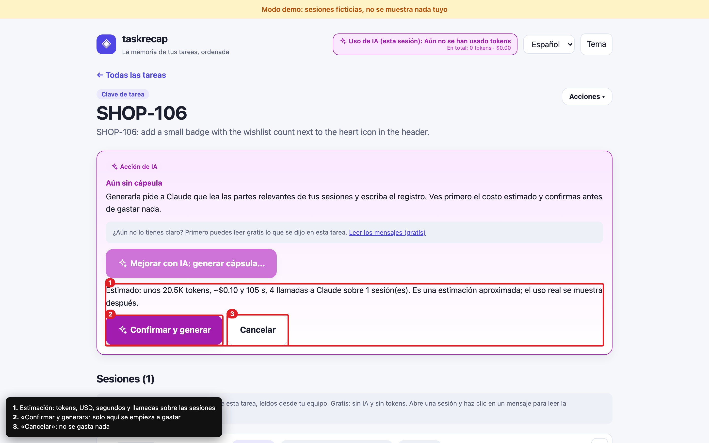

1. **Estimación**: tokens, dólares, segundos y llamadas sobre las sesiones. Los botones son **Confirmar y generar** y **Cancelar**.
2. **Confirmar** lanza el trabajo y muestra el **panel de progreso**.
3. **Cancelar** cierra la estimación sin gastar nada.

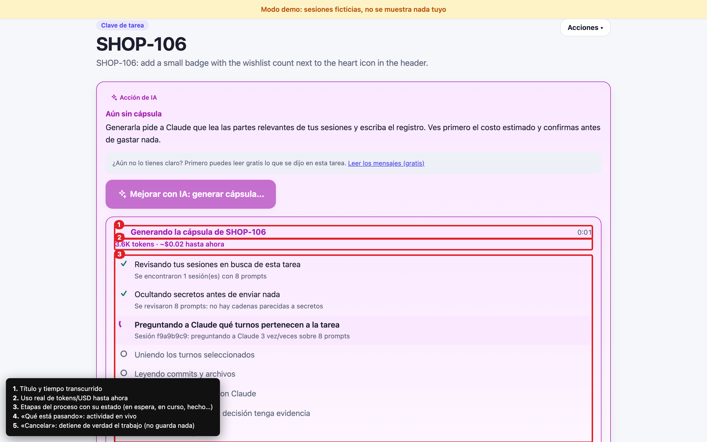

El panel de progreso contiene:

| Elemento | Qué muestra |
| --- | --- |
| Título y tiempo | El nombre de la acción y el tiempo transcurrido |
| Uso | Los tokens y el coste **reales** acumulados hasta ahora |
| **Etapas** | La lista del proceso real (revisión, ocultar secretos, votos, unión, evidencia, escritura, validación, guardado) con su estado: en espera, en curso, hecho, omitido o falló |
| **Qué está pasando** | Registro de actividad en vivo |
| **Cancelar** | Detiene de verdad el trabajo: corta la conexión, el servidor mata el proceso y no se guarda nada. Las llamadas ya terminadas siguen contando |
| Cierre / Reintentar | Al acabar aparecen **Cerrar** y, tras un fallo o una cancelación, **Intentar de nuevo** |

Al terminar con éxito se muestra el **uso real** y, si sigues en esa ficha, la cápsula nueva se redibuja.

En las unidades de **sesión o grupo**, los mensajes que pertenecen a la tarea **ya se conocen**, así que se omite el paso de selección: hay **una sola llamada** a Claude y la estimación lo indica («los N mensajes ya se conocen, así que se omite el paso de selección»).

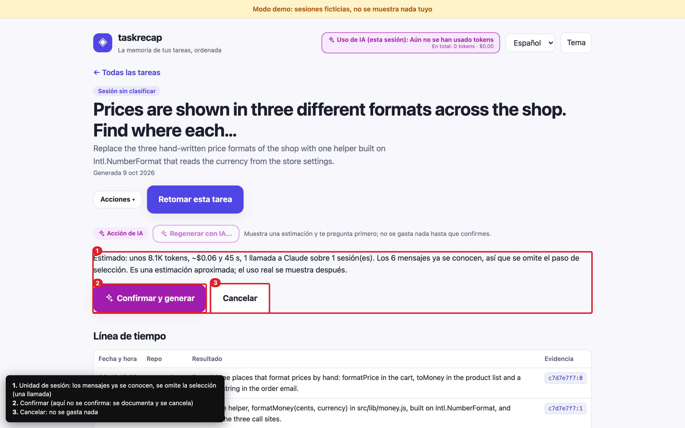

### Unidad de sesión

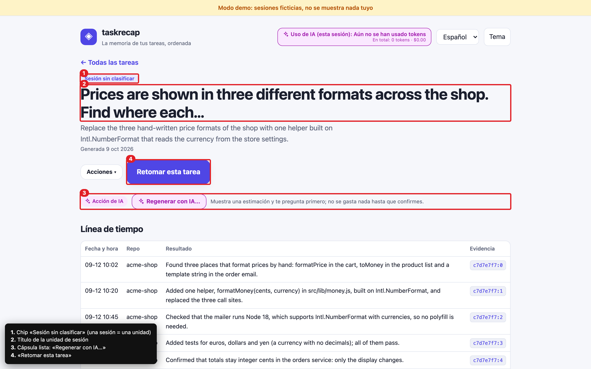

Una sesión sin clave de tarea ni rama es su propia unidad: el encabezado la marca como **Sesión sin clasificar**, tiene cápsula propia y ofrece **Regenerar con IA…** y **Retomar esta tarea** como cualquier otra.

### Estados de carga, vacío y error

- **Cargando…**: mientras llega el detalle.
- **Algo salió mal: <mensaje>** con el botón **Reintentar**: si falla la carga del detalle o de la estimación (en la estimación fallida no se ha gastado nada).
- **Ninguno**: cuando una sección no tiene entradas.
- **Las acciones con IA no están disponibles**: si no se encontró Claude Code, el botón de generar queda desactivado y aparece una nota con los pasos para instalarlo y el botón **Comprobar de nuevo**. Navegar y leer siguen funcionando.
- **No se pudieron cargar los mensajes: <mensaje>**: error al listar una sesión.

### Vista completa

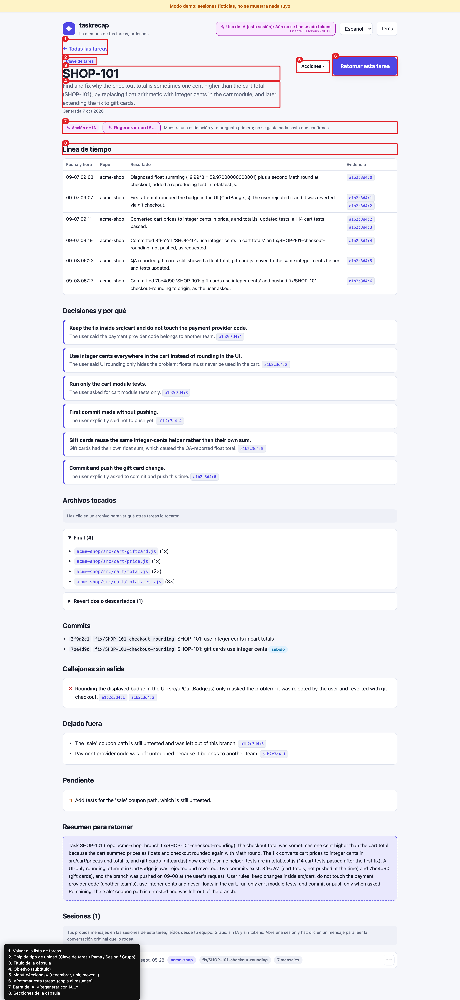

La misma página en **tema oscuro**:

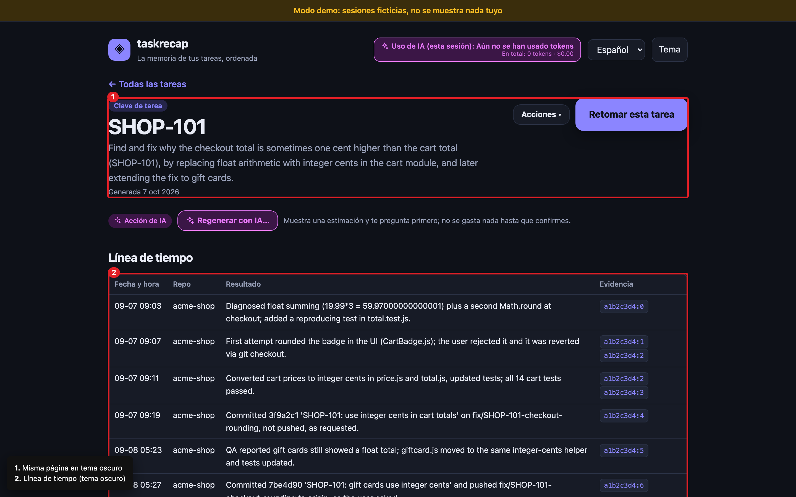

## Interfaz común

Esta sección cubre los controles que son **iguales en todas las páginas** de taskrecap: la barra superior, el menú de acciones de una unidad, los diálogos que lo acompañan, el panel de Organizar con IA, el panel de evidencia y los avisos (toast). El cuerpo de cada página se documenta aparte: la portada en §Inicio y la página de una unidad en §Ficha.

### Barra superior

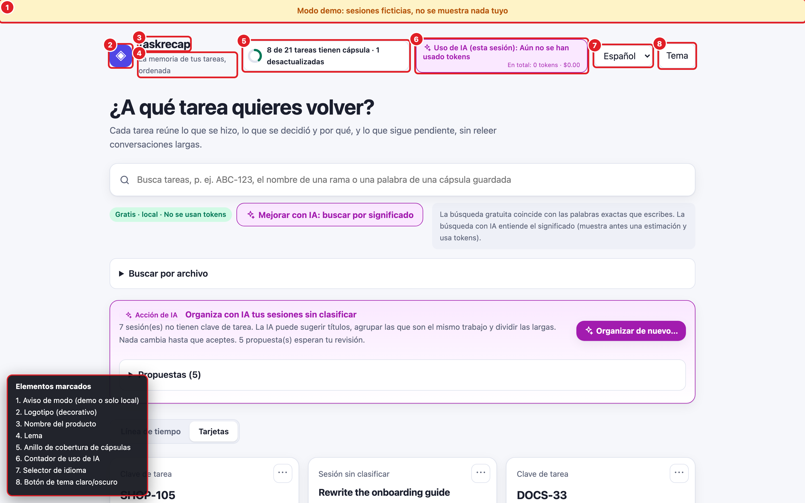

Se muestra sobre la portada y sobre la ficha de cada tarea.

| Elemento | Etiqueta visible | Qué hace |
| --- | --- | --- |
| Enlace de salto | «Saltar al contenido principal» | Solo se ve al pulsar `Tab`; lleva el foco al título de la página. |
| Logotipo | ◈ | Decorativo (oculto para lectores de pantalla). |
| Marca | «taskrecap» | Nombre del producto. |
| Lema | «La memoria de tus tareas, ordenada» | Texto fijo bajo el nombre. |
| Aviso | «Modo demo: sesiones ficticias…» o «Solo local: tus sesiones nunca salen de este equipo» | Indica el modo de ejecución; no es un botón. |
| Cobertura | «N de M tareas tienen cápsula» | Anillo de progreso; al pulsarlo filtra la línea de tiempo a las tareas sin cápsula. |
| Uso de IA | «Uso de IA (esta sesión): …» | Contador de tokens y dólares; se actualiza solo. |
| Idioma | English / Español | Desplegable nativo; cambia el idioma de toda la interfaz. |
| Tema | «Tema» | Alterna entre claro y oscuro. |

#### Enlace de salto

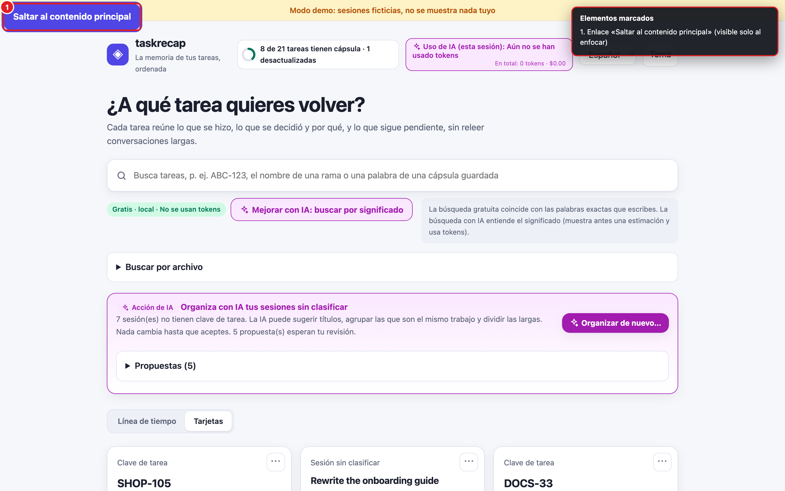

Está oculto hasta que se enfoca con `Tab` desde el principio de la página. Sirve para saltar la cabecera e ir directo al contenido principal con el teclado.

#### Aviso de modo (banner)

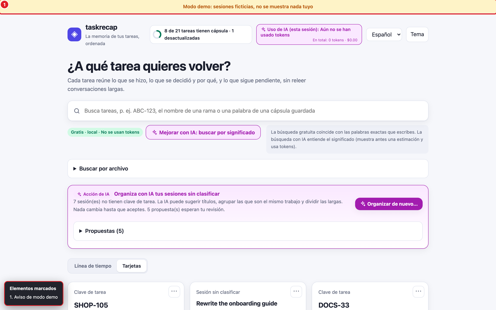

Ocupa todo el ancho en la parte más alta. El texto depende del arranque:

- En modo demo: «Modo demo: sesiones ficticias, no se muestra nada tuyo».
- En uso normal: «Solo local: tus sesiones nunca salen de este equipo».

Es un aviso informativo (`role="note"`), no se puede pulsar.

#### Cobertura de cápsulas

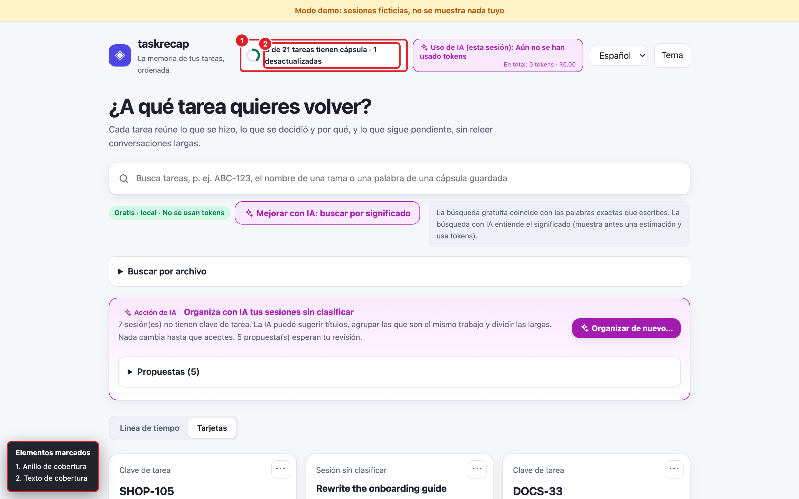

El anillo cuenta solo las tareas que **pueden** tener cápsula: muestra «N de M tareas tienen cápsula» y, si las hay, añade «· K desactualizadas». Al **pulsarlo**, la línea de tiempo y las tarjetas se filtran para mostrar solo las tareas **sin** cápsula; el botón queda marcado (`aria-pressed=true`) y aparece la franja «Mostrando solo las tareas sin cápsula» con un botón «Mostrar todas las tareas» para quitarlo. Si no hay ninguna tarea generable, el anillo no se muestra.

#### Contador de uso de IA

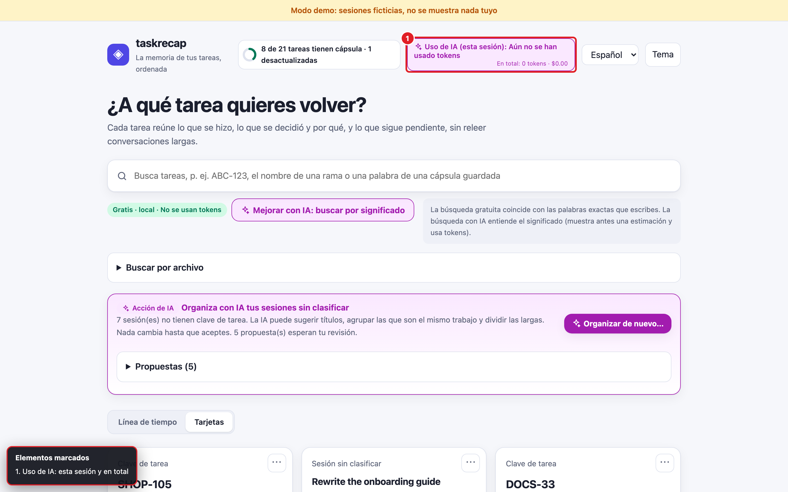

Muestra dos líneas: «Uso de IA (esta sesión): N tokens · $X» y, debajo, «En total: …». Si todavía no se ha usado nada, dice «Aún no se han usado tokens». Se actualiza en vivo cada vez que termina una acción con IA y queda guardado en `~/.taskrecap/usage.json`, así que el total se conserva entre arranques.

#### Idioma

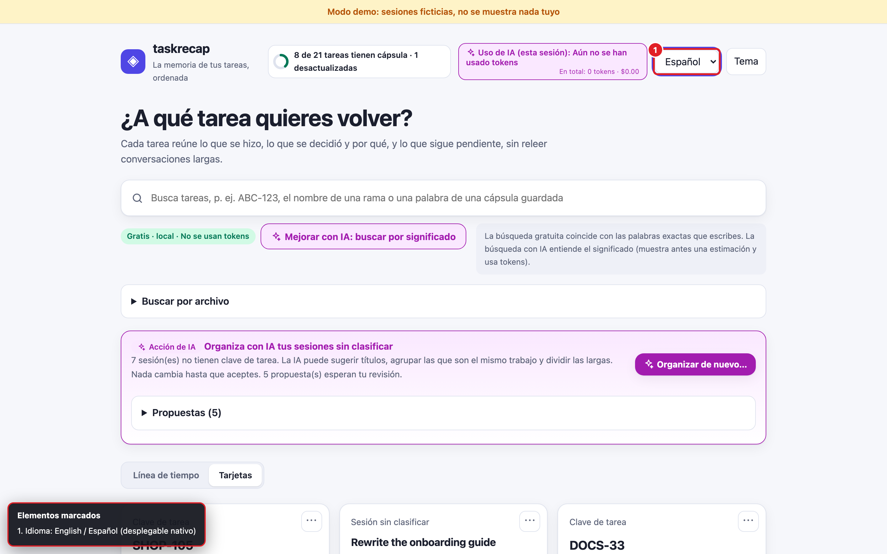

El desplegable ofrece los idiomas que sirve el servidor: **English** y **Español**. Al elegir otro idioma se guarda la preferencia en el navegador (`localStorage`, clave `tr-lang`) y **la página se recarga** para reconstruir todos los textos en el idioma nuevo. Si un idioma guardado ya no está disponible, se usa el del navegador y, si no, el del servidor.

#### Tema

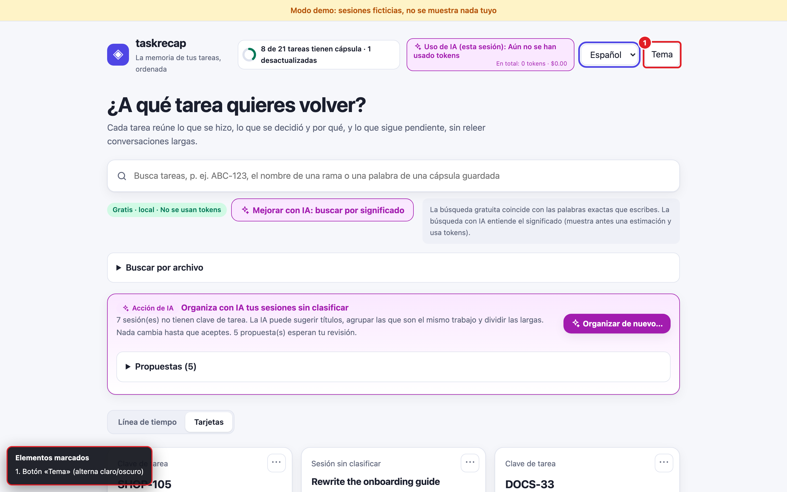

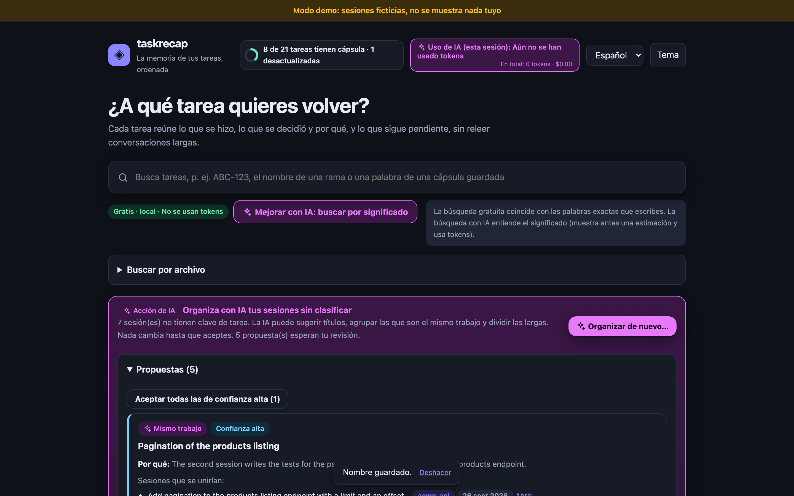

El botón dice «Tema» y alterna entre claro y oscuro. La elección se guarda en el navegador (clave `wc-theme`). Si no has elegido nunca, taskrecap respeta el tema del sistema (auto).

### Menú de acciones de la unidad (⋯)

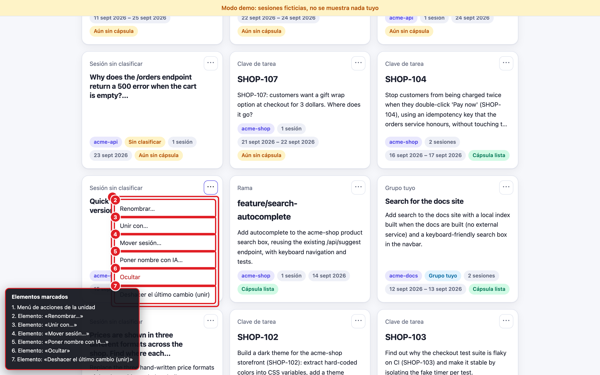

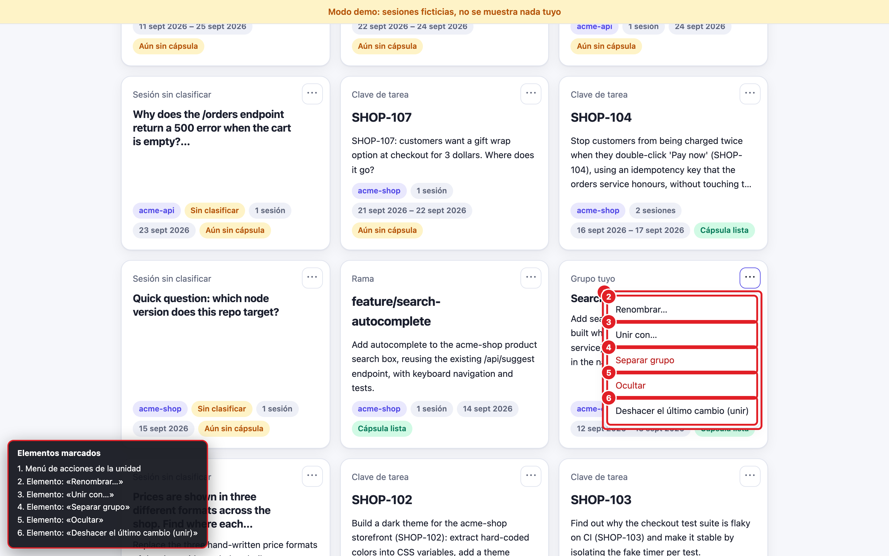

Cada unidad tiene un botón «⋯» (con `aria-haspopup="menu"`). Se abre desde la tarjeta en §Inicio, desde la etiqueta de una fila de la línea de tiempo y desde la cabecera de la ficha. El conjunto de elementos depende del tipo de unidad:

| Elemento | Cuándo aparece | Qué hace |
| --- | --- | --- |
| «Renombrar…» | Siempre | Abre el diálogo para poner un nombre propio. |
| «Unir con…» | Siempre que exista otra unidad | Abre el diálogo para unir dos unidades en un grupo. |
| «Mover sesión…» | Unidad formada por una sola sesión | Abre el diálogo para mover esa sesión a otra unidad o a un grupo nuevo. |
| «Separar grupo» | Si la unidad se puede separar (p. ej. un grupo tuyo) | Disuelve el grupo y devuelve sus sesiones a donde les corresponde. Aparece en rojo. |
| «Poner nombre con IA…» | Sesión sin clasificar, de una sola sesión, sin división y sin ruido | Abre la estimación de «poner nombre» con IA. Se desactiva si la IA no está disponible. |
| «Ocultar» / «Mostrar de nuevo» | Siempre | Oculta la unidad (o la vuelve a mostrar) en la lista, la línea de tiempo y los recuentos. «Ocultar» aparece en rojo. |
| «Deshacer el último cambio (X)» | Siempre | Deshace el último cambio (`X` es el tipo: renombrar, unir, mover, separar, ocultar, división con IA). Si no hay nada, dice «Nada que deshacer» y queda desactivado. |

En la ficha de una unidad, cada fila de sesión tiene su propio menú, con tres elementos: «Mover a otra unidad…», «Ocultar esta sesión» (en rojo) y «Deshacer el último cambio».

Teclado y cierre: las flechas `Arriba`/`Abajo` recorren los elementos, `Intro` ejecuta el enfocado y `Escape` cierra el menú devolviendo el foco al botón «⋯». Un clic fuera del menú también lo cierra.

### Diálogos de la unidad

Todos los diálogos comparten la misma carcasa: un fondo oscurecido que cierra al pulsarlo y un panel centrado con título, campos y dos botones («Cancelar» y la acción). Con el teclado, `Escape` cierra, `Intro` dentro de un campo confirma y `Tab` queda atrapado dentro del diálogo; al cerrarse, el foco vuelve al botón que lo abrió. Cada cambio acaba con un aviso (toast) que incluye «Deshacer».

#### Renombrar

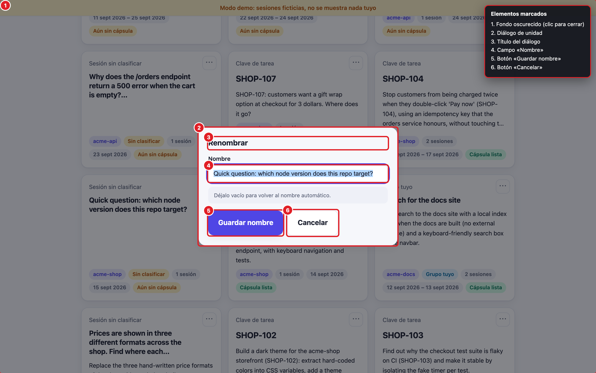

- Título: «Renombrar». Campo «Nombre», con la pista «Déjalo vacío para volver al nombre automático.».
- Botón «Guardar nombre» (o «Cancelar»). Al guardar, el aviso dice «Nombre guardado.» con opción de deshacer.

#### Unir

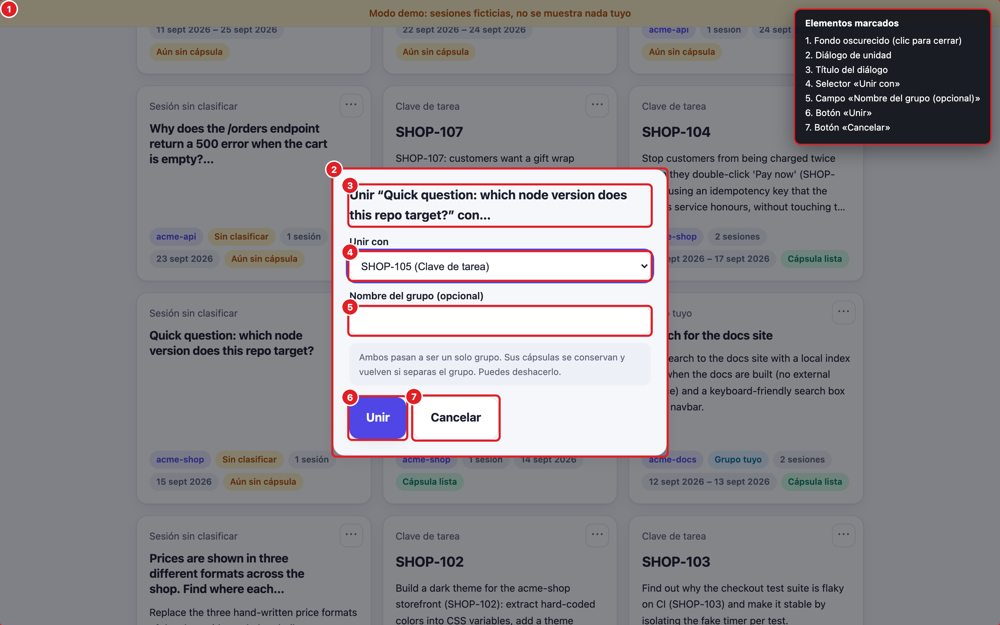

- Título: «Unir “nombre” con…». Selector «Unir con» (lista las demás unidades con su tipo) y campo opcional «Nombre del grupo (opcional)».
- Nota: «Ambos pasan a ser un solo grupo. Sus cápsulas se conservan y vuelven si separas el grupo. Puedes deshacerlo.».
- Botón «Unir». Aviso: «Unidos en un solo grupo.».

#### Mover

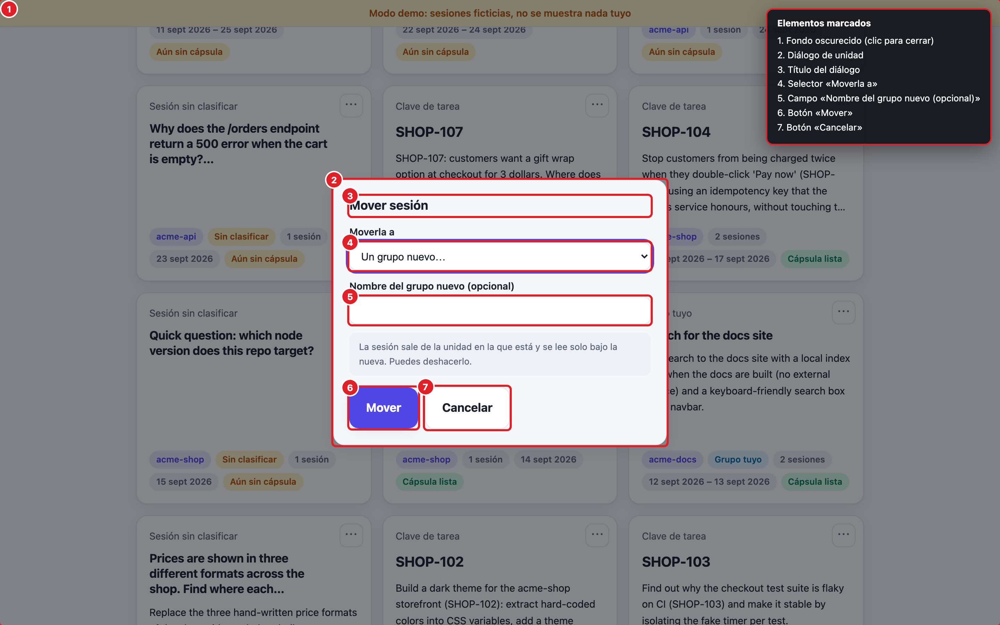

- Título: «Mover sesión». Selector «Moverla a»; incluye la opción «Un grupo nuevo…». El campo «Nombre del grupo nuevo (opcional)» solo aparece si eliges un grupo nuevo.
- Nota: «La sesión sale de la unidad en la que está y se lee solo bajo la nueva. Puedes deshacerlo.».
- Botón «Mover». Aviso: «Sesión movida.».

#### Ocultar (y separar)

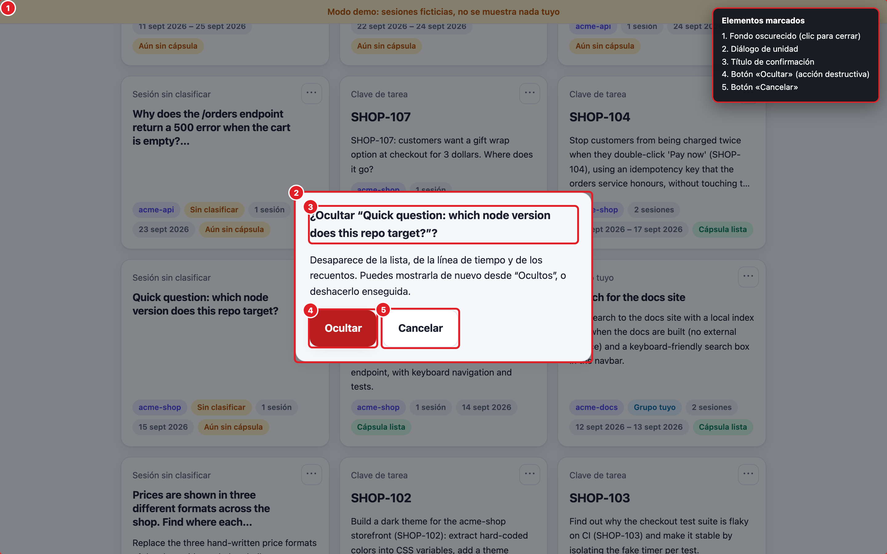

- Título: «¿Ocultar “nombre”?» (o «¿Ocultar esta sesión?»). Es una acción destructiva: el botón «Ocultar» va en rojo.
- Texto: «Desaparece de la lista, de la línea de tiempo y de los recuentos. Puedes mostrarla de nuevo desde “Ocultos”, o deshacerlo enseguida.».
- Desde la sección «Ocultos» (n) o el propio menú, «Mostrar de nuevo» revierte la acción.

El diálogo de separar es análogo: título «¿Separar “nombre”?», botón «Separar» en rojo y el aviso «Grupo separado.».

### Organizar con IA

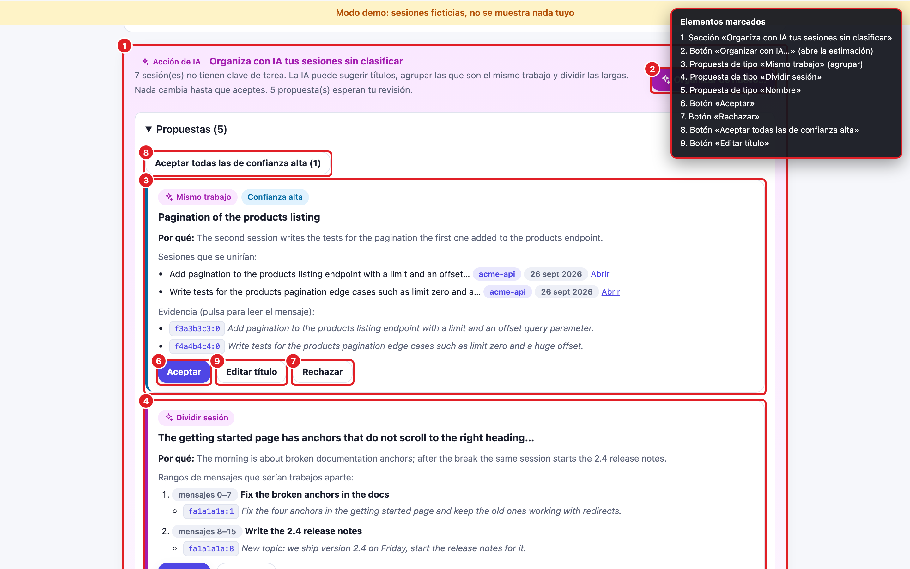

Aparece en la parte alta de §Inicio cuando hay sesiones sin clasificar o propuestas pendientes. Lleva el distintivo «Acción de IA» y el título «Organiza con IA tus sesiones sin clasificar», con un resumen del número de sesiones sin clave de tarea. El botón principal es «Organizar con IA…» (o «Organizar de nuevo…» si ya hay propuestas).

Al abrir las propuestas («Propuestas (n)») se ven tres tipos:

| Tipo | Qué propone |
| --- | --- |
| «Nombre» | Un título para una sesión suelta, más «Nombre actual: …». |
| «Mismo trabajo» | Agrupar varias sesiones del mismo trabajo, con el motivo («Por qué: …») y la evidencia. |
| «Dividir sesión» | Partir una sesión larga en varios trabajos, mostrando los rangos de mensajes. |

Cada propuesta indica su confianza («Confianza alta», «Confianza media», «Confianza baja») y trae los botones «Aceptar» y «Rechazar». Las de nombre y grupo permiten además «Editar título» (que cambia el botón a «Aceptar con este título» y añade «Cancelar»). Arriba, si hay propuestas de confianza alta, aparece «Aceptar todas las de confianza alta (n)». Las citas de la evidencia («Evidencia (pulsa para leer el mensaje):») abren el panel de evidencia.

#### Diálogo de Organizar (la estimación antes de gastar)

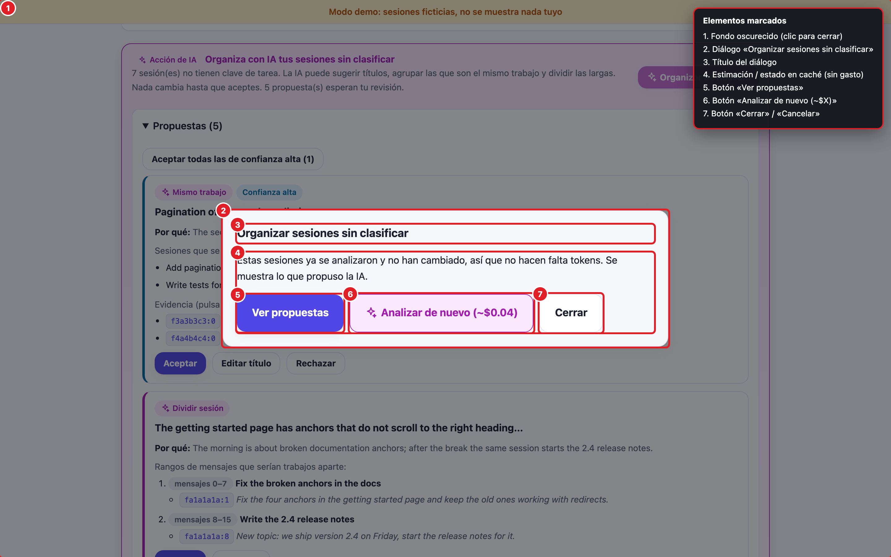

Al pulsar «Organizar con IA…» se abre un diálogo que **siempre muestra el coste antes de gastar nada**:

- Si las sesiones ya se analizaron sin cambios, avisa de que no hacen falta tokens y ofrece «Ver propuestas», «Analizar de nuevo (~$X)» y «Cerrar».
- Si hay que analizar, muestra «Estimado: unos N tokens, ~$X, N llamada(s), sobre N sesión(es)…» y solo entonces el botón «Confirmar y organizar» (o «Cancelar»). Al confirmar hay progreso en vivo y se puede cancelar.

#### Poner nombre con IA

Desde el menú «⋯» de una sesión sin clasificar, la opción «Poner nombre con IA…» abre una estimación equivalente («para un título») y, tras confirmar, muestra el nombre propuesto con los mismos botones «Aceptar» / «Editar título» / «Rechazar».

Regla clave: **nada se aplica hasta que pulsas «Aceptar»** (o «Aceptar todas»). Al aceptar, la corrección es igual que hacerla a mano, así que se puede deshacer. Las unidades creadas así llevan la etiqueta «Organizado con IA». Una propuesta rechazada no vuelve a mostrarse.

### Panel de evidencia

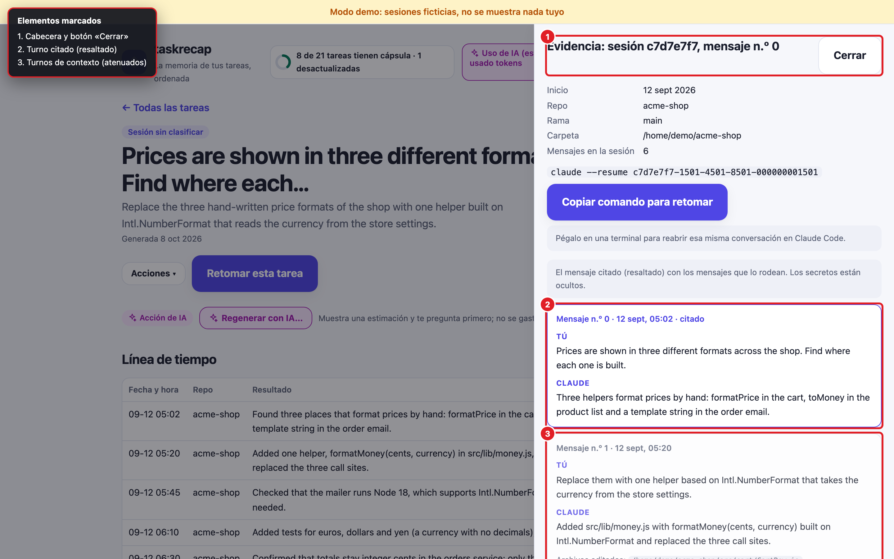

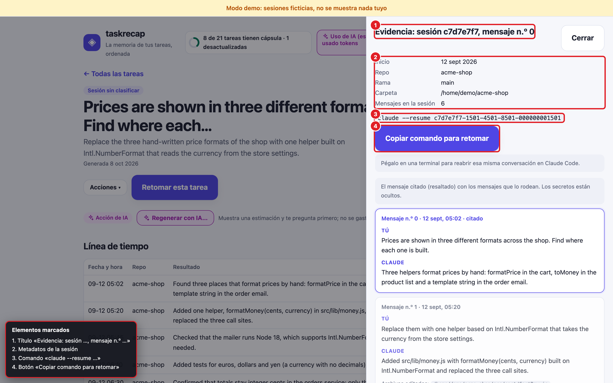

Se abre al pulsar una cita (en §Ficha o en las propuestas de Organizar con IA). Es un panel lateral, gratuito y local. Muestra:

- Cabecera «Evidencia: sesión {id}, mensaje n.º {n}» con el botón «Cerrar».
- Metadatos de la sesión: «Inicio», «Repo», «Rama», «Carpeta» y «Mensajes en la sesión».
- El comando de retomar (`claude --resume …`) con el botón «Copiar comando para retomar» (que pasa a «¡Copiado!»).
- La nota «El mensaje citado (resaltado) con los mensajes que lo rodean. Los secretos están ocultos.» El turno citado aparece resaltado y los de alrededor atenuados.
- Si la cita apunta fuera de los mensajes con los que se escribió la cápsula, se muestra un aviso amarillo: «Esta cita apunta fuera de los mensajes… Compruébala antes de fiarte.».

Se cierra con `Escape`, pulsando el fondo oscurecido o el botón «Cerrar»; el foco vuelve al botón que lo abrió.

### Avisos (toast)

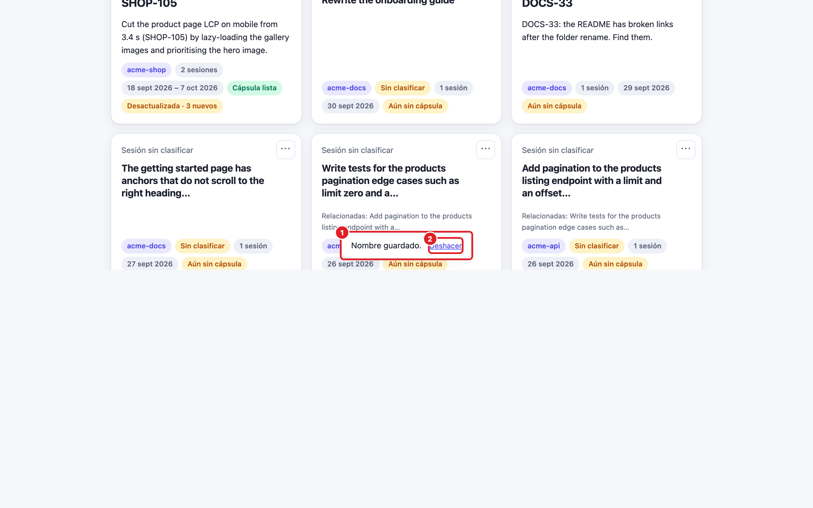

Es una banda pequeña abajo, en el centro, que confirma lo que acaba de pasar. Es una región de estado (`role="status"`, `aria-live="polite"`), por lo que los lectores de pantalla la anuncian. Ejemplos: «¡Copiado! Pégalo en una sesión nueva de Claude», «No se pudo copiar…», «Nombre guardado.», «Unidos en un solo grupo.», «Sesión movida.», «Oculto.», «Se muestra de nuevo.», «Grupo separado.», «Propuesta aceptada.» o «Cambio deshecho.». Cuando el cambio se puede revertir, el aviso incluye el enlace «Deshacer». Se oculta solo a los pocos segundos.

### Comportamiento común

Estos patrones valen en toda la aplicación:

- **Escape** cierra el menú, el diálogo o el panel abierto.
- **Foco**: los diálogos y paneles atrapan el `Tab` y devuelven el foco al elemento que los abrió; al cambiar de página el foco va al título.
- **Teclado**: el enlace de salto, las flechas del menú y los controles de la línea de tiempo permiten usar taskrecap sin ratón.
- **Temas**: claro y oscuro, con respeto al tema del sistema; la elección se recuerda.

Para el contenido propio de cada página, consulta §Inicio y §Ficha.
